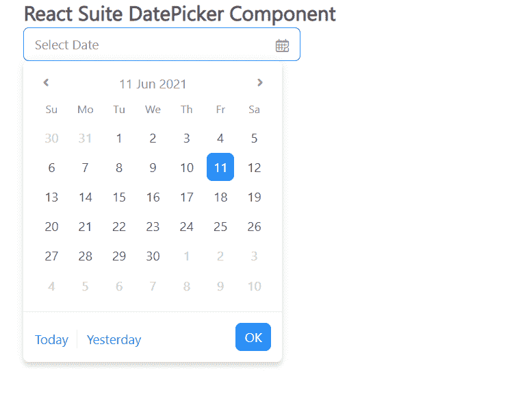

# 反应套件日期选择器组件

> 原文:[https://www . geesforgeks . org/react-suite-date picker-component/](https://www.geeksforgeeks.org/react-suite-datepicker-component/)

React Suite 是一个流行的前端库，包含一组为中间平台和后端产品设计的 React 组件。日期选择器  组件允许用户选择或输入日期或时间。我们可以在 ReactJS 中使用以下方法来使用 React Suite 日期选择器组件。

**DatePicker Props:**

*   **外观:**用于组件外观。
*   **块:**用于块整行。
*   **日历默认日期:**用于表示日历面板默认的显示日期和时间。
*   **可清洗:**用于指示选项是否可以清空。
*   **容器:**用于设置渲染容器。
*   **defaultOpen:** 用于表示 Open 属性的默认值。
*   **默认值:**用于表示默认值。
*   **禁用:**表示组件是否禁用。
*   **禁用日期:**用于禁用日期。
*   **禁用小时:**用于禁用小时。
*   **禁用分钟:**用于禁用分钟。
*   **禁用秒:**用于禁用秒。
*   **格式:**用于表示日期的格式。
*   **隐藏小时:**用于隐藏小时。
*   **隐藏分钟:**用于隐藏分钟。
*   **隐藏秒:**用于隐藏秒。
*   **内联:**用于显示组件初始时的日期面板。
*   **等周:**表示 ISO 8601 标准集与否的布尔值。
*   **limitEndYear:** 用于设置可用年份相对于当前选择日期的下限。
*   **地区:**用于 *i18n* 配置。
*   **onChange:** 是值发生变化时触发的回调函数。
*   **onChangeCalendarDate:** 是日历日期发生变化时触发的回调函数。
*   **onClean:** 是值清空时触发的回调函数。
*   **onClose:** 是关闭事件触发的回调函数。
*   **onEnter:** 是一个回调函数，在叠加转换之前触发。
*   **OneHinded:**这是一个回调函数，在覆盖完成转换后触发。
*   **OnLining:**这是一个回调函数，当覆盖开始转换时被触发。
*   **onExit:** 它是一个回调函数，在覆盖转换之前被触发。
*   **onexitted:**是一个回调函数，在覆盖完成转换后触发。
*   **onExiting:** 是一个回调函数，在叠加开始向外过渡时触发。
*   **下个月:**用于切换到下个月的回拨功能。
*   **onOk:** 这是一个回调函数，在单击确定按钮确定时触发。
*   **onOpen:** 是组件打开时触发的回调函数。
*   **onPrevMonth:** 是切换到前一个月的回调函数。
*   **onSelect:** 是在选择日期或时间时触发的回调函数。
*   **ontoglemonthdrop:**是切换到月视图的回调函数。
*   **ontogletimedropdown:**是切换到时间视图的回调函数。
*   **oneTap:** 表示是否启用一键完成选择日期。
*   **打开:**表示是否打开组件。
*   **占位符:**用于表示占位符。
*   **放置:**用于元件的放置。
*   **preventOverflow:** 用于防止浮动元素溢出。
*   **范围:**用于快捷配置。
*   **showMeridian:** 用于以 12 种格式显示小时。
*   **显示周数:**表示是否显示周数。
*   **toggleComponentClass:** 可用于该组件的自定义元素。
*   **值:**用于表示值(受控)。

**创建反应应用程序并安装模块:**

*   **步骤 1:** 使用以下命令创建一个反应应用程序:

    ```jsx
    npx create-react-app foldername
    ```

*   **步骤 2:** 创建项目文件夹(即文件夹名**)后，使用以下命令移动到该文件夹中:**

    ```jsx
    cd foldername
    ```

*   **步骤 3:** 创建 ReactJS 应用程序后，使用以下命令安装所需的****模块:****

    ```jsx
    **npm install rsuite**
    ```

******项目结构:**如下图。****

****

项目结构**** 

******示例:**现在在 **App.js** 文件中写下以下代码。在这里，App 是我们编写代码的默认组件。****

## ****App.js****

```jsx
**import React from 'react'
import 'rsuite/dist/styles/rsuite-default.css';
import { DatePicker } from 'rsuite';

export default function App() {

  return (
    <div style={{
      display: 'block', width: 600, paddingLeft: 30
    }}>
      <h4>React Suite DatePicker Component</h4>
      <DatePicker
        style={{ width: 300 }}
        placeholder="Select Date"
      />
    </div>
  );
}**
```

******运行应用程序的步骤:**从项目的根目录使用以下命令运行应用程序:****

```jsx
**npm start**
```

******输出:**现在打开浏览器，转到***http://localhost:3000/***，会看到如下输出:****

********

******参考:**T2】https://rsuitejs.com/components/date-picker/****