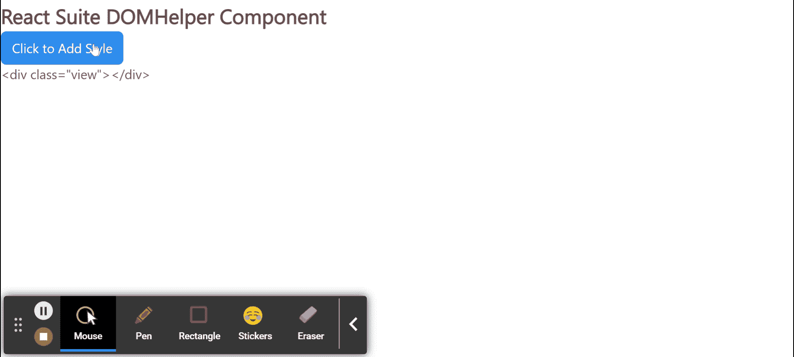
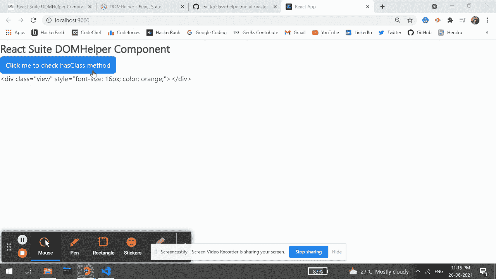

# 反应套件多帮手组件

> 原文:[https://www . geesforgeks . org/react-suite-DOM helper-component/](https://www.geeksforgeeks.org/react-suite-domhelper-component/)

React Suite 是一个流行的前端库，包含一组为中间平台和后端产品设计的 React 组件。DOMHelper 组件允许用户出于某些考虑直接操纵 DOM。  我们可以在 ReactJS 中使用以下方法来使用 React Suite DOMHelper 组件。

**domousemovetracker:**用于鼠标拖动跟踪器。此方法采用以下参数:

*   **onMove:** 是运动激活时触发的功能。
*   **onMoveEnd:** 是运动停止时触发的功能。
*   **节点:**用来表示 HTML 元素。

**创建反应应用程序并安装模块:**

*   **步骤 1:** 使用以下命令创建一个反应应用程序:

    ```
    npx create-react-app foldername
    ```

*   **步骤 2:** 在创建项目文件夹(即文件夹名**)后，使用以下命令将**移动到该文件夹:

    ```
    cd foldername
    ```

*   **步骤 3:** 创建 ReactJS 应用程序后，使用以下命令安装所需的****模块:****

    ```
    **npm install @rsuite/charts**
    ```

******项目结构:**如下图。****

****

项目结构**** 

******示例 1:** 在下面的示例中，我们使用了*添加圆柱*方法，在单击按钮时将样式添加到我们的元素中。****

******文件名:App.js******

## ****App.js****

```
**import React from 'react'
import 'rsuite/dist/styles/rsuite-default.css';
import { Button, DOMHelper } from 'rsuite';
const { addStyle } = DOMHelper;

export default class App extends React.Component {

  // State holding initial style
  constructor(props) {
    super(props);
    this.state = {
      htmlCode: '<div class="view"></div>'
    };
  }

  // Function to set the states with latest style
  showView() {
    const htmlCode = this.container.innerHTML;
    this.setState({ htmlCode });
  }

  // Function to add the styles
  addTheStyling() {
    addStyle(this.view, { 'margin-top': '16px', 'color': 'orange' });
    this.showView();
  }

  render() {
    const { htmlCode } = this.state;
    return (
      <div>
        <h4>React Suite DOMHelper Component</h4>
        <Button appearance="primary" onClick={() => this.addTheStyling()}
        > Click to Add Style
        </Button>

        <div>{htmlCode}</div>
        <div ref={ref => { this.container = ref }}>
          <div className="view" ref={ref => { this.view = ref }} />
        </div>
      </div>
    );
  }
}**
```

******运行应用程序的步骤:**从项目的根目录使用以下命令运行应用程序:****

```
**npm start**
```

******输出:**现在打开浏览器，转到***http://localhost:3000/***，会看到如下输出:****

********

******示例 2:** 在下面的示例中，我们使用了 *hasClass* 方法来检查元素是否有自定义命名的类，当用户点击按钮时会触发该功能。****

******文件名:App.js******

## ****套房****

```
**import React from 'react'
import 'rsuite/dist/styles/rsuite-default.css';
import { Button, DOMHelper } from 'rsuite';
const { hasClass } = DOMHelper;

export default class App extends React.Component {

    // State holding initial style
    constructor(props) {
        super(props);
        this.state = {
            htmlCode: `<div class="view" style="font-size: 16px; 
            color: orange;"></div>`
        };
    }

    render() {
        const { htmlCode } = this.state;
        return (
            <div>
                <h4>React Suite DOMHelper Component</h4>
                <Button appearance="primary" onClick={() =>
                    alert(hasClass(this.view, 'custom'))}
                > Click me to check hasClass method
                </Button>

                <div>{htmlCode}</div>
                <div ref={ref => { this.container = ref }}>
                    <div className="view" ref={ref => { this.view = ref }} />
                </div>
            </div >
        );
    }
}**
```

******运行应用程序的步骤:**从项目的根目录使用以下命令运行应用程序:****

```
**npm start**
```

******输出:**现在打开浏览器，转到***http://localhost:3000/***，会看到如下输出:****

********

******参考:**https://rsuitejs.com/components/dom-helper/****