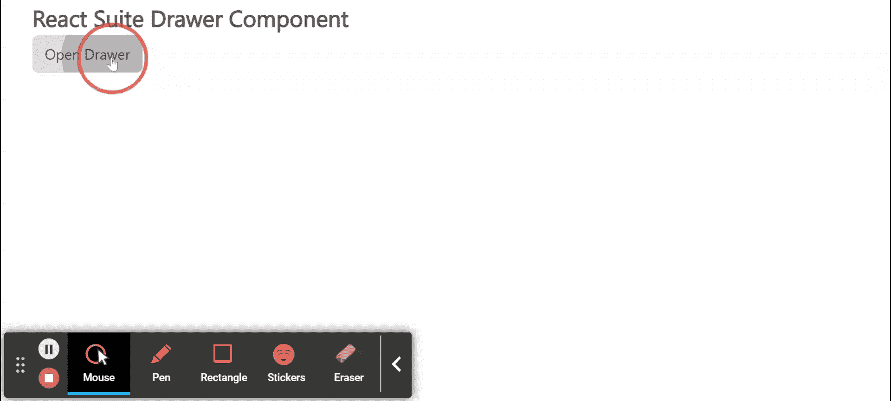

# 反应套件抽屉组件

> 原文:[https://www.geeksforgeeks.org/react-suite-drawer-component/](https://www.geeksforgeeks.org/react-suite-drawer-component/)

React Suite 是一个流行的前端库，包含一组为中间平台和后端产品设计的 React 组件。抽屉组件是从屏幕边缘滑入的面板。我们可以在 ReactJS 中使用以下方法来使用 React Suite 抽屉组件。

**抽屉道具:**

*   **自动对焦:**抽屉打开，自动对焦，当设置为真时，屏幕阅读器可以访问。
*   **背景:**当设置为真时，抽屉打开时会显示背景。
*   **backdropbclassname:**用于为*增加一个可选的额外类名。模态背景*。
*   **类前缀:**用于表示组件 CSS 类的前缀。
*   **强制焦点:**当设置为真时，抽屉将防止焦点在打开时离开。
*   **全屏:**用于启用全屏。
*   **键盘:**按下 ESC 键会关闭抽屉。
*   **onEnter:** 是一个回调函数，在抽屉转换之前触发。
*   **OneHinded:**这是一个回调函数，在抽屉完成转换后触发。
*   **OnLining:**是一个回调函数，在抽屉开始转换时触发。
*   **onExit:** 它是一个回调函数，就在抽屉过渡出来之前触发。
*   **onexitted:**是一个回调函数，在抽屉完成转换后触发。
*   **onExiting:** 是一个回调函数，在抽屉开始向外过渡时触发。
*   **onHide:** 是抽屉隐藏时触发的回调函数。
*   **onShow:** 是抽屉显示时触发的回拨功能。
*   **放置:**用于放置抽屉。
*   **显示:**用于显示抽屉。
*   **尺寸:**用于设置抽屉尺寸。

**创建反应应用程序并安装模块:**

*   **步骤 1:** 使用以下命令创建一个反应应用程序:

    ```
    npx create-react-app foldername
    ```

*   **步骤 2:** 创建项目文件夹(即文件夹名**)后，使用以下命令移动到该文件夹中:**

    ```
    cd foldername
    ```

*   **步骤 3:** 创建 ReactJS 应用程序后，使用以下命令安装所需的****模块:****

    ```
    **npm install rsuite**
    ```

******项目结构:**如下图。****

****

项目结构**** 

******示例:**现在在 **App.js** 文件中写下以下代码。在这里，App 是我们编写代码的默认组件。****

## ****App.js****

```
**import React from 'react'
import 'rsuite/dist/styles/rsuite-default.css';
import { Drawer, Button } from 'rsuite'

export default function App() {

  // Drawer state
  const [isDrawerOpen, setIsDrawerOpen] = React.useState(false)

  // Function to close drawer
  const closeDrawer = () => {
    setIsDrawerOpen(false);
  }

  // Function to toggle Drawer
  const toggleDrawer = () => {
    setIsDrawerOpen(true);
  }

  return (
    <div style={{
      display: 'block', width: 700, paddingLeft: 30
    }}>
      <h4>React Suite Drawer Component</h4>
      <div>
        <Button onClick={toggleDrawer}>
          Open Drawer
        </Button>
        <Drawer
          show={isDrawerOpen}
          onHide={closeDrawer}
        >
          <Drawer.Header>
            <Drawer.Title>Sample Title for Drawer</Drawer.Title>
          </Drawer.Header>
          <Drawer.Body>
            Greetings from GeeksforGeeks!
          </Drawer.Body>
          <Drawer.Footer>
            <Button onClick={closeDrawer} appearance="primary">
              Confirm
            </Button>
            <Button onClick={closeDrawer} appearance="subtle">
              Cancel
            </Button>
          </Drawer.Footer>
        </Drawer>
      </div>
    </div>
  );
}**
```

******运行应用程序的步骤:**从项目的根目录使用以下命令运行应用程序:****

```
**npm start**
```

******输出:**现在打开浏览器，转到***http://localhost:3000/***，会看到如下输出:****

********

******参考:**T2】https://rsuitejs.com/components/drawer/****