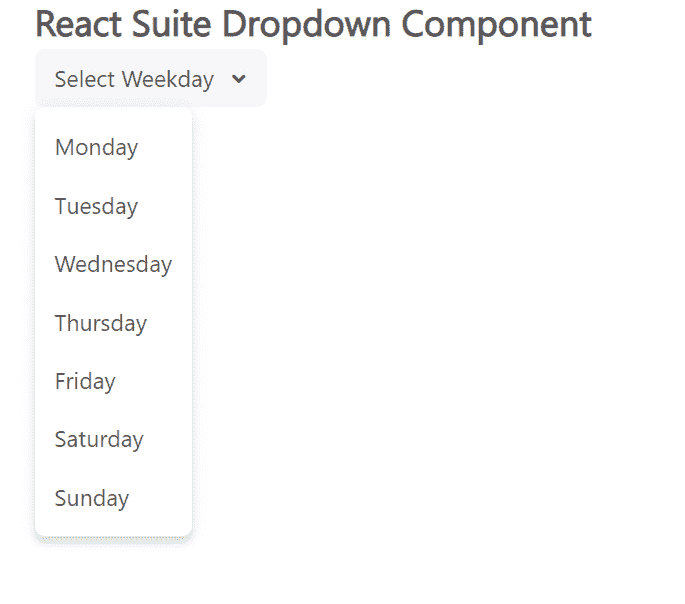

# 反应套件下拉组件

> 原文:[https://www . geesforgeks . org/react-suite-drop down-component/](https://www.geeksforgeeks.org/react-suite-dropdown-component/)

React Suite 是一个流行的前端库，包含一组为中间平台和后端产品设计的 React 组件。下拉菜单  组件允许用户提供  导航，如果你想选择一个值，使用选择选择器。我们可以在 ReactJS 中使用以下方法来使用 React Suite 下拉组件。

**下拉道具:**

*   **激活键:**用于设置激活下拉项组件中事件键对应状态的选项。
*   **类前缀:**用于表示组件 CSS 类的前缀。
*   **禁用:**表示组件是否禁用。
*   **图标:**用于设置图标。
*   **menuStyle:** 用于表示菜单的样式。
*   **onClose:** 是菜单关闭时触发的功能。
*   **onOpen:** 是菜单打开时触发的功能。
*   **onSelect:** 这是一个在选择菜单项时触发的功能。
*   **ontogle:**是菜单状态切换时触发的功能。
*   **开启:**用于表示受控开启状态。
*   **放置:**用于菜单的放置。
*   **渲染标题:**用于表示自定义标题
*   **标题:**菜单默认显示内容。
*   **toggleClassName:** 用于表示应用于 Toggle DOM 节点的 CSS 类
*   **toggleComponentClass:** 可以作为这个组件的自定义元素。
*   **触发器:**用于触发事件。

**下拉列表。物品道具:**

*   **激活:**用于使当前选项的状态激活。
*   **儿童:**表示主要内容。
*   **类前缀:**用于表示组件 CSS 类的前缀。
*   **componentClass:** 可以作为该组件的自定义元素类型。
*   **禁用:**用于禁用当前选项。
*   **分割线:**用于指示是否显示分割线。
*   **事件键:**用于表示当前选项的值。
*   **图标:**用于设置图标。
*   **onSelect:** 这是一个在选择当前选项时触发的功能。
*   **面板:**用于显示自定义面板。
*   **渲染项:**用于自定义渲染项。

**下拉列表。菜单道具:**

*   **图标:**用于设置图标。
*   **向左拉:**用于使子菜单从左侧展开，默认向右展开。
*   **标题:**用于将标题定义为子菜单。

**创建反应应用程序并安装模块:**

*   **步骤 1:** 使用以下命令创建一个反应应用程序:

    ```jsx
    npx create-react-app foldername
    ```

*   **步骤 2:** 在创建项目文件夹(即文件夹名**)后，使用以下命令将**移动到该文件夹:

    ```jsx
    cd foldername
    ```

*   **步骤 3:** 创建 ReactJS 应用程序后，使用以下命令安装所需的****模块:****

    ```jsx
    **npm install rsuite**
    ```

******项目结构:**如下图。****

****

项目结构**** 

******示例:**现在在 **App.js** 文件中写下以下代码。在这里，App 是我们编写代码的默认组件。****

## ****App.js****

```jsx
**import React from 'react'
import 'rsuite/dist/styles/rsuite-default.css';
import { Dropdown } from 'rsuite';

export default function App() {

  return (
    <div style={{
      display: 'block', width: 700, paddingLeft: 30
    }}>
      <h4>React Suite Dropdown Component</h4>
      <Dropdown title="Select Weekday">
        <Dropdown.Item>Monday</Dropdown.Item>
        <Dropdown.Item>Tuesday</Dropdown.Item>
        <Dropdown.Item>Wednesday</Dropdown.Item>
        <Dropdown.Item>Thursday</Dropdown.Item>
        <Dropdown.Item>Friday</Dropdown.Item>
        <Dropdown.Item>Saturday</Dropdown.Item>
        <Dropdown.Item>Sunday</Dropdown.Item>
      </Dropdown>
    </div>
  );
}**
```

******运行应用程序的步骤:**从项目的根目录使用以下命令运行应用程序:****

```jsx
**npm start**
```

******输出:**现在打开浏览器，转到***http://localhost:3000/***，会看到如下输出:****

********

******参考:**T2】https://rsuitejs.com/components/dropdown/****