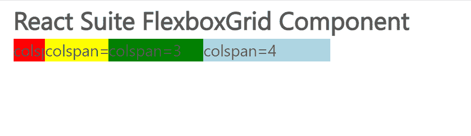

# 反应套件 FlexboxGrid 组件

> 原文:[https://www . geeksforgeeks . org/react-suite-flexbox grid-component/](https://www.geeksforgeeks.org/react-suite-flexboxgrid-component/)

React Suite 是一个流行的前端库，包含一组为中间平台和后端产品设计的 React 组件。FlexboxGrid 组件允许用户使用 24 个网格，因为它是通过 CSS Flexbox 实现的 g rid 布局组件。我们可以在 ReactJS 中使用以下方法来使用 React Suite FlexboxGrid 组件。

**FlexboxGrid Props:**

*   **对齐:**用于对齐。
*   **类前缀:**用于表示组件 CSS 类的前缀。
*   **正名:**用于水平排列。

**FlexboxGrid。项目建议:**

*   **类前缀:**用于表示组件 CSS 类的前缀。
*   **colspan:** 用于表示网格之间的间距。
*   **顺序:**用于表示排序的网格顺序。
*   **componentClass:** 可用于该组件的自定义元素。

**创建反应应用程序并安装模块:**

*   **步骤 1:** 使用以下命令创建一个反应应用程序:

    ```jsx
    npx create-react-app foldername
    ```

*   **步骤 2:** 在创建项目文件夹(即文件夹名**)后，使用以下命令将**移动到该文件夹:

    ```jsx
    cd foldername
    ```

*   **步骤 3:** 创建 ReactJS 应用程序后，使用以下命令安装所需的****模块:****

    ```jsx
    **npm install rsuite**
    ```

******项目结构:**如下图。****

****

项目结构**** 

******示例:**现在在 **App.js** 文件中写下以下代码。在这里，App 是我们编写代码的默认组件。****

## ****App.js****

```jsx
**import React from 'react'
import 'rsuite/dist/styles/rsuite-default.css';
import { FlexboxGrid } from 'rsuite'

export default function App() {

  return (
    <div style={{
      display: 'block', width: 700, paddingLeft: 30
    }}>
      <h4>React Suite FlexboxGrid Component</h4>
      <FlexboxGrid>
        <FlexboxGrid.Item style={{ backgroundColor: 'red' }} 
                          colspan={1}>
          colspan={1}</FlexboxGrid.Item>
        <FlexboxGrid.Item style={{ backgroundColor: 'yellow' }} 
                          colspan={2}>
          colspan={2}</FlexboxGrid.Item>
        <FlexboxGrid.Item style={{ backgroundColor: 'green' }} 
                          colspan={3}>
          colspan={3}</FlexboxGrid.Item>
        <FlexboxGrid.Item style={{ backgroundColor: 'lightblue' }}
                          colspan={4}>
          colspan={4}</FlexboxGrid.Item>
      </FlexboxGrid>
    </div>
  );
}**
```

******运行应用程序的步骤:**从项目的根目录使用以下命令运行应用程序:****

```jsx
**npm start**
```

******输出:**现在打开浏览器，转到***http://localhost:3000/***，会看到如下输出:****

********

******参考:**T2】https://rsuitejs.com/components/flexbox-grid/****