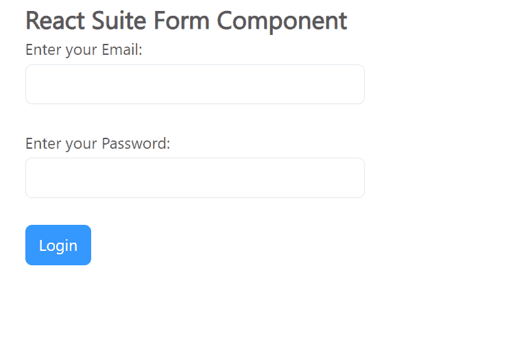

# 反应套件表单组件

> 原文:[https://www.geeksforgeeks.org/react-suite-form-component/](https://www.geeksforgeeks.org/react-suite-form-component/)

React Suite 是一个流行的前端库，包含一组为中间平台和后端产品设计的 React 组件。 Form Component 提供了一种制作表单并接受用户输入，然后将其转发到服务器进行进一步数据处理的方法。我们可以在 ReactJS 中使用以下方法来使用 React Suite 表单组件。

**形态道具:**

*   **Check Delay:** is used to delay processing when data is checked.
*   **Checktrigger:** is used to indicate the form validation trigger type.
*   **Class Prefix:** Prefix used to represent component CSS class.
*   [T0】 error from Context: 【T1] used to indicate that the error reminder in FormControl comes from Context by default.
*   **Fluid:** It allows 100% form input to fill the container.
*   **Form Default Value:** is used to represent the default value of the form.
*   **Form Error:** Error information for the form.
*   **formvalue:** The value that represents the form (controlled).
*   **Layout:** Used to set the left and right columns of the layout of elements in the form.
*   **Model:** is used to represent the SchemaModel object.
*   **onchange:** is a callback function triggered when data changes.
*   **oncheck:** is a callback function triggered during data check.
*   **on error:** is a callback function triggered during error checking.

**形成方法:**

*   **检查:**此方法用于验证表单数据。
*   **checkAsync:** 是检查表单数据的异步函数。
*   **检查字段:**此方法用于核对单个字段值。
*   **checkForFieldAsync:** 是检查表单单字段值的异步函数。
*   **清除错误:**此方法用于清除错误信息。
*   **cleanErrorForFiled:** 此方法用于清除单个字段错误消息。

**形状控制命题:**

*   **受体:**表示被代理的成分。
*   **checkTrigger:** 用于表示数据验证触发类型。
*   **类前缀:**用于表示组件 CSS 类的前缀。
*   **错误信息:**用于显示错误信息。
*   **错误放置:**用于放置错误信息。
*   **名称:**用于表示表单控件的名称。
*   **只读:**用于使控件只读。
*   **明文:**用于制作控制明文。

**表单组道具:**

*   **类前缀:**用于表示组件 CSS 类的前缀。
*   **控制标识:**用于设置受控部件的*标识*。

**控件标签命题:**

*   **类前缀:**用于表示组件 CSS 类的前缀。
*   **htmlFor:** 用于表示 HTML 标签标签的属性。
*   **srOnly:** 仅用于屏幕阅读器。

**助推器块命题:**

*   **类前缀:**用于表示组件 CSS 类的前缀。
*   **htmlFor:** 用于表示 HTML 标签标签的属性。
*   **工具提示:**用于指示是否通过工具提示组件显示。

**创建反应应用程序并安装模块:**

*   **步骤 1:** 使用以下命令创建一个反应应用程序:

    ```
    npx create-react-app foldername
    ```

*   **步骤 2:** 创建项目文件夹(即文件夹名**)后，使用以下命令移动到该文件夹中:**

    ```
    cd foldername
    ```

*   **步骤 3:** 创建 ReactJS 应用程序后，使用以下命令安装所需的****模块:****

     ****```
    npm install rsuite
    ```**** 

******项目结构:**如下图。****

****

项目结构**** 

******示例:**现在在 **App.js** 文件中写下以下代码。在这里，App 是我们编写代码的默认组件。****

## ****App.js****

```
**import React from 'react'
import 'rsuite/dist/styles/rsuite-default.css';
import {
  Form, FormGroup, FormControl, Button,
  ControlLabel,
} from 'rsuite';

export default function App() {

  return (
    <div style={{
      display: 'block', width: 700, paddingLeft: 30
    }}>
      <h4>React Suite Form Component</h4>
      <Form>
        <FormGroup>
          <ControlLabel>Enter your Email:</ControlLabel>
          <FormControl name="email" type="email" />
        </FormGroup>
        <FormGroup>
          <ControlLabel>Enter your Password:</ControlLabel>
          <FormControl name="password" type="password" />
        </FormGroup>
        <FormGroup>
          <Button appearance="primary">Login</Button>
        </FormGroup>
      </Form>
    </div>
  );
}**
```

******运行应用程序的步骤:**从项目的根目录使用以下命令运行应用程序:****

```
**npm start**
```

******输出:**现在打开浏览器，转到***http://localhost:3000/***，会看到如下输出:****

********

******参考:**T2】https://rsuitejs.com/components/form/****