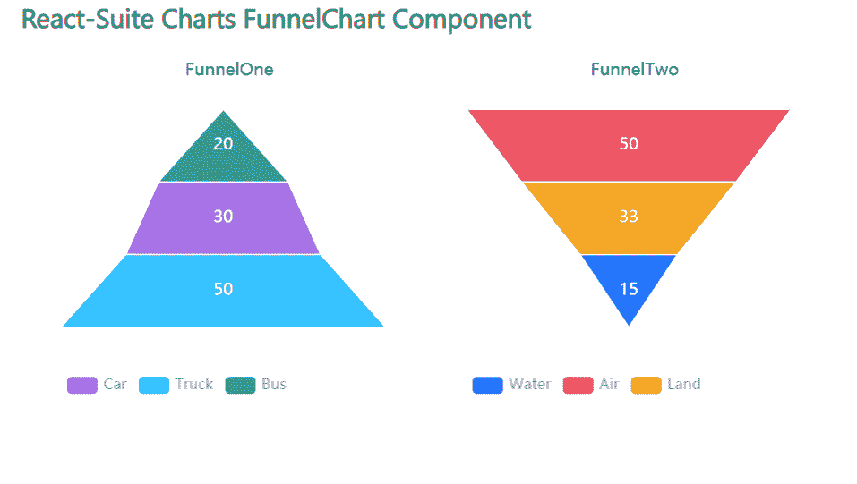

# 反应套件漏斗图组件

> 原文:[https://www . geesforgeks . org/react-suite-漏斗图-component/](https://www.geeksforgeeks.org/react-suite-funnelchart-component/)

React Suite Charts 是一个流行的前端库，包含一组 React 组件，用于提供一组基于 rsuite 和 echarts 的图表。漏斗图  组件允许用户以漏斗的形式提供数据。我们可以在 ReactJS 中使用以下方法来使用 React Suite 漏斗图组件。

**漏斗图道具:**

*   **名称:**用于表示图形的名称。
*   **数据:**用于传递图形的数据。
*   **asc:** 表示是否以升序显示图形。

**创建反应应用程序并安装模块:**

*   **步骤 1:** 使用以下命令创建一个反应应用程序:

    ```jsx
    npx create-react-app foldername
    ```

*   **步骤 2:** 创建项目文件夹(即文件夹名**)后，使用以下命令移动到该文件夹中:**

    ```jsx
    cd foldername
    ```

*   **步骤 3:** 创建 ReactJS 应用程序后，使用以下命令安装所需的****模块:****

    ```jsx
    **npm install @rsuite/charts**
    ```

******项目结构:**如下图。****

****

项目结构**** 

******示例:**现在在 **App.js** 文件中写下以下代码。在这里，App 是我们编写代码的默认组件。****

## ****App.js****

```jsx
**import React from 'react'
import 'rsuite/dist/styles/rsuite-default.css';
import { FunnelChart, Funnel } from '@rsuite/charts';

export default function App() {

  // Sample data for Funnel 1
  const sampleData1 = [
    ['Car', 30],
    ['Truck', 50],
    ['Bus', 20],
  ];

  // Sample data for Funnel 2
  const sampleData2 = [
    ['Water', 15],
    ['Air', 50],
    ['Land', 33]
  ];

  return (
    <div style={{
      display: 'block', width: 700, paddingLeft: 30
    }}>
      <h4>React-Suite Charts FunnelChart Component</h4>
      <FunnelChart>
        <Funnel name="FunnelOne" data={sampleData1} asc />
        <Funnel name="FunnelTwo" data={sampleData2} />
      </FunnelChart>
    </div >
  );
}**
```

******运行应用程序的步骤:**从项目的根目录使用以下命令运行应用程序:****

```jsx
**npm start**
```

******输出:**现在打开浏览器，转到***http://localhost:3000/***，会看到如下输出:****

********

******参考:**T2】https://charts.rsuitejs.com/#%E6%BC%8F%E6%96%97%E5%9B%BE****