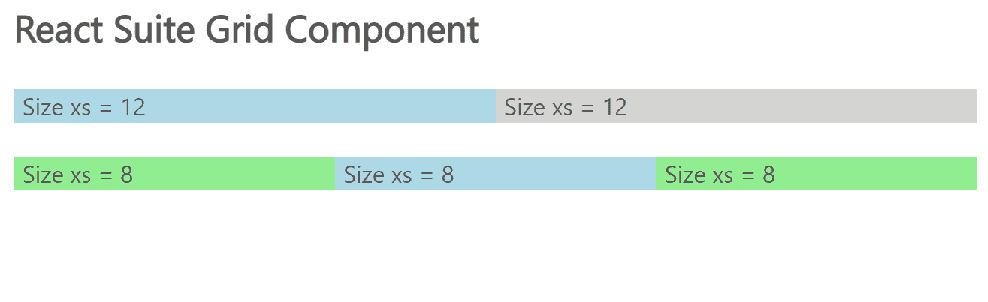

# 反应套件网格组件

> 原文:[https://www.geeksforgeeks.org/react-suite-grid-component/](https://www.geeksforgeeks.org/react-suite-grid-component/)

React Suite 是一个流行的前端库，包含一组为中间平台和后端产品设计的 React 组件。网格  组件允许用户提供 24 个网格。 有助于实现响应设计。我们可以在 ReactJS 中使用以下方法来使用 React Suite 网格组件。

**格子道具:**

*   **componentClass:** 可用于该组件的自定义元素类型。
*   **流体:**用于流体布局。

**排道具:**

*   **componentClass:** 可用于该组件的自定义元素类型。
*   **天沟:**用于表示网格的间距。

**Col 道具:**

*   **componentClass:** 可用于该组件的自定义元素类型。
*   **lg:** 用于表示屏幕尺寸≥ 1200 像素的大型设备桌面希望跨越的列数。
*   **lgHidden:** 用于隐藏大型设备桌面上的列。
*   **lgOffset:** 用于将中型设备桌面的列向右移动。
*   **lgPull:** 用于更改大型设备桌面左侧网格列的顺序。
*   **lgPush:** 用于大型设备桌面将网格列的顺序向右更改。
*   **md:** 用于表示屏幕尺寸≥ 992 像素的中型设备台式机希望跨越的列数。
*   **mdHidden:** 用于隐藏中型设备桌面上的列。
*   **mdOffset:** 用于将中型设备桌面的列向右移动。
*   **mdPull:** 用于更改中型设备桌面左侧网格列的顺序。
*   **mdPush:** 用于将中型设备桌面的网格列顺序向右更改。
*   **sm:** 用于表示屏幕尺寸≥ 480 像素的小型设备平板电脑希望跨越的列数。
*   **smHidden:** 用于隐藏小设备平板电脑上的栏目。
*   **smOffset:** 用于将小设备平板电脑的列向右移动。
*   **smPull:** 用于小设备平板向左改变网格列的顺序。
*   **smPush:** 用于小设备平板电脑将网格列的顺序向右更改。
*   **xs:** 用于表示您希望为超小型设备跨越的列数屏幕尺寸为< 480 像素的手机。
*   **xsHidden:** 用于隐藏超小型设备手机上的栏目。
*   **xsOffset:** 用于将超小型设备的列向右移动 Phones。
*   **xsPull:** 用于改变超小型设备 Phones 向左的网格列顺序。
*   **xsPush:** 用于将极小设备 Phones 的网格列顺序向右更改。

**创建反应应用程序并安装模块:**

*   **步骤 1:** 使用以下命令创建一个反应应用程序:

    ```jsx
    npx create-react-app foldername
    ```

*   **步骤 2:** 在创建项目文件夹(即文件夹名**)后，使用以下命令将**移动到该文件夹:

    ```jsx
    cd foldername
    ```

*   **步骤 3:** 创建 ReactJS 应用程序后，使用以下命令安装所需的****模块:****

    ```jsx
    **npm install rsuite**
    ```

******项目结构:**如下图。****

****

项目结构**** 

******示例:**现在在 **App.js** 文件中写下以下代码。在这里，App 是我们编写代码的默认组件。****

## ****App.js****

```jsx
**import React from 'react'
import 'rsuite/dist/styles/rsuite-default.css';
import { Grid, Row, Col } from 'rsuite';

export default function App() {

  return (
    <div style={{
      display: 'block', width: 600, paddingLeft: 30
    }}>
      <h4>React Suite Grid Component</h4> <br></br>
      <Grid fluid>
        <Row className="show-grid">
          <Col style={{backgroundColor:'lightblue'}} 
               xs={12}>Size xs = 12
          </Col>
          <Col style={{backgroundColor:'lightgrey'}} 
               xs={12}>Size xs = 12 
          </Col>
        </Row>
        <br></br>
        <Row className="show-grid">
          <Col style={{backgroundColor:'lightgreen'}} 
               xs={8}>Size xs = 8
          </Col>
          <Col style={{backgroundColor:'lightblue'}} 
               xs={8}>Size xs = 8
          </Col>
          <Col style={{backgroundColor:'lightgreen'}}
               xs={8}>Size xs = 8
          </Col>
        </Row>
      </Grid>
    </div>
  );
}**
```

******运行应用程序的步骤:**从项目的根目录使用以下命令运行应用程序:****

```jsx
**npm start**
```

******输出:**现在打开浏览器，转到***http://localhost:3000/***，会看到如下输出:****

********

******参考:**T2】https://rsuitejs.com/components/grid/****