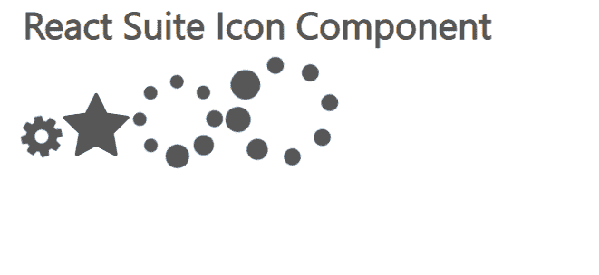

# 反应套件图标组件

> 原文:[https://www.geeksforgeeks.org/react-suite-icon-component/](https://www.geeksforgeeks.org/react-suite-icon-component/)

React Suite 是一个流行的前端库，包含一组为中间平台和后端产品设计的 React 组件。图标组件允许用户将图标添加到应用程序中。图标常用于的中，用于用户界面目的。我们可以在 ReactJS 中使用以下方法来使用 React Suite 图标组件。

**图标道具:**

*   **类前缀:**用于表示组件 CSS 类的前缀。
*   **componentClass:** 用于传递该组件的自定义元素。
*   **固定宽度:**用于设置固定的图标宽度。
*   **翻转:**用于翻转图标。
*   **图标:**用于表示图标名称。
*   **反转:**用于反转颜色。
*   **脉冲:**我们可以用脉冲让它旋转 8 步。
*   **旋转:**用于旋转图标。
*   **大小:**用于设置图标大小。
*   **旋转:**用于动态旋转图标。
*   **堆叠:**用于组合多个图标。
*   **svgStyle:** 用于设置 SVG 风格。

**图标堆叠道具：**

*   **类前缀:**用于表示组件 CSS 类的前缀。
*   **大小:**用来表示大小。

**创建反应应用程序并安装模块:**

*   **步骤 1:** 使用以下命令创建一个反应应用程序:

    ```jsx
    npx create-react-app foldername
    ```

*   **步骤 2:** 在创建项目文件夹(即文件夹名**)后，使用以下命令将**移动到该文件夹:

    ```jsx
    cd foldername
    ```

*   **步骤 3:** 创建 ReactJS 应用程序后，使用以下命令安装所需的****模块:****

    ```jsx
    **npm install rsuite**
    ```

******项目结构:**如下图。****

****

项目结构**** 

******示例:**现在在 **App.js** 文件中写下以下代码。在这里，App 是我们编写代码的默认组件。****

## ****App.js****

```jsx
**import React from 'react'
import 'rsuite/dist/styles/rsuite-default.css';
import { Icon } from 'rsuite'

export default function App() {
  return (
    <div style={{
      display: 'block', width: 700, paddingLeft: 30
    }}>
      <h4>React Suite Icon Component</h4>
      <Icon icon="cog" size="2x" spin />
      <Icon icon='star' size="3x" />
      <Icon icon="spinner" size="4x" pulse />
      <Icon icon="spinner" size="5x" spin />
    </div>
  );
}**
```

******运行应用程序的步骤:**从项目的根目录使用以下命令运行应用程序:****

```jsx
**npm start**
```

******输出:**现在打开浏览器，转到***http://localhost:3000/***，会看到如下输出:****

********

******参考:**T2】https://rsuitejs.com/components/icon/****