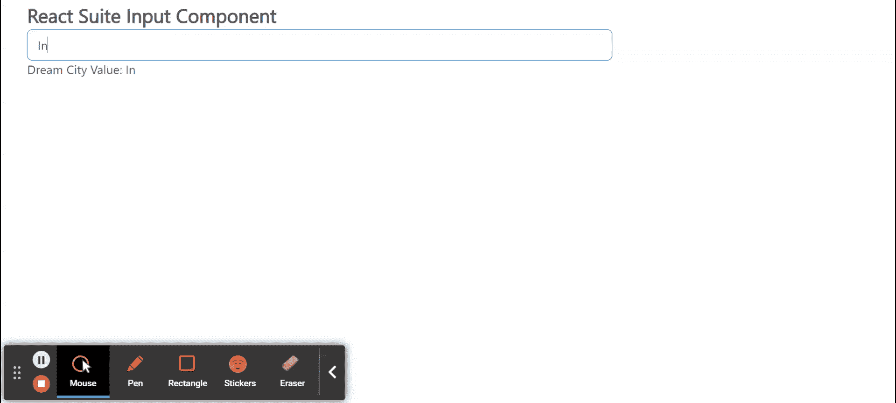

# 反应套件输入组件

> 原文:[https://www.geeksforgeeks.org/react-suite-input-component/](https://www.geeksforgeeks.org/react-suite-input-component/)

React Suite 是一个流行的前端库，包含一组为中间平台和后端产品设计的 React 组件。输入  组件允许用户 允许用户 创建一个基本的小部件，用于获取用户输入的是一个文本字段。我们可以在 ReactJS 中使用以下方法来使用 React Suite 输入组件。

**输入道具:**

*   **类前缀:**用于表示组件 CSS 类的前缀。
*   **默认值:**用于表示默认值。
*   **禁用:**用于禁用组件。
*   **onChange:** 是值改变时触发的回调函数。
*   **大小:**用于表示输入大小。
*   **类型:**用于表示 HTML 输入类型。
*   **值:**用于表示值(受控)。

**输入组道具:**

*   **类前缀:**用于表示组件 CSS 类的前缀。
*   **内部:**用于内部设置构图内容。
*   **大小:**用于表示输入组大小。

**创建反应应用程序并安装模块:**

*   **步骤 1:** 使用以下命令创建一个反应应用程序:

    ```
    npx create-react-app foldername
    ```

*   **步骤 2:** 在创建项目文件夹(即文件夹名**)后，使用以下命令将**移动到该文件夹:

    ```
    cd foldername
    ```

*   **步骤 3:** 创建 ReactJS 应用程序后，使用以下命令安装所需的****模块:****

    ```
    **npm install rsuite**
    ```

******项目结构:**如下图。****

****

项目结构**** 

******示例:**现在在 **App.js** 文件中写下以下代码。在这里，App 是我们编写代码的默认组件。****

## ****App.js****

```
**import React from 'react'
import 'rsuite/dist/styles/rsuite-default.css';
import { Input } from 'rsuite';

export default function App() {

  // State of our dream city
  const [dreamCity, setDreamCity] = React.useState('')

  return (
    <div style={{
      display: 'block', width: 700, paddingLeft: 30
    }}>
      <h4>React Suite Input Component</h4>
      <Input
        placeholder="Enter your dream city"
        onChange={(e) => setDreamCity(e)}
      />
      Dream City Value: {dreamCity}
    </div>
  );
}**
```

******运行应用程序的步骤:**从项目的根目录使用以下命令运行应用程序:****

```
**npm start**
```

******输出:**现在打开浏览器，转到***http://localhost:3000/***，会看到如下输出:****

********

******参考:**T2】https://rsuitejs.com/components/input/****