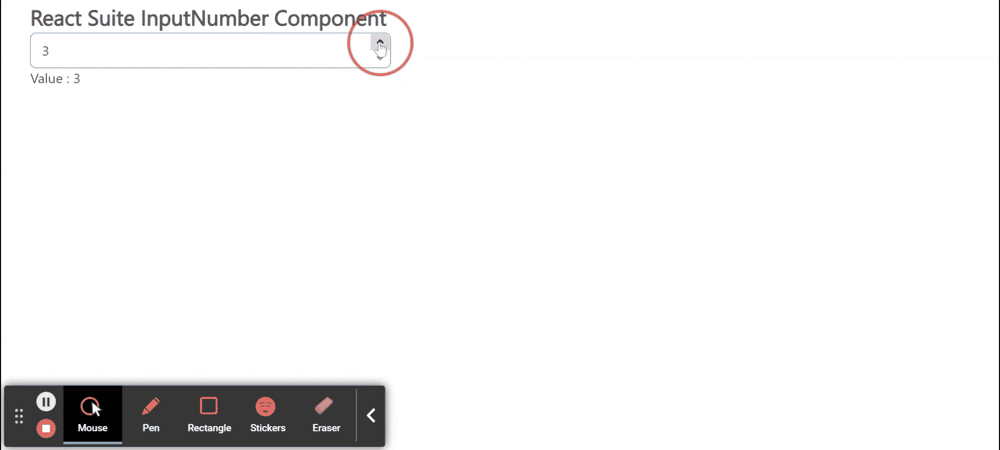

# 反应套件输入数字组件

> 原文:[https://www . geesforgeks . org/react-suite-input number-component/](https://www.geeksforgeeks.org/react-suite-inputnumber-component/)

React Suite 是一个流行的前端库，包含一组为中间平台和后端产品设计的 React 组件。输入数字  组件允许用户借助键盘或鼠标输入一定范围内的数字。我们可以在 ReactJS 中使用以下方法来使用 React Suite InputNumber 组件。

**输入编号属性：**

*   **类前缀:**用于表示组件 CSS 类的前缀。
*   **默认值:**用于表示默认值。
*   **禁用:**用于禁用组件。
*   **max:** 用于表示最大值。
*   **min:** 用于表示最小值。
*   **onChange:** 是值改变时触发的回调函数。
*   **后缀:**用于设置组件右侧显示的元素。
*   **前缀:**用于设置组件左侧显示的元素。
*   **可滚动:**用于表示是否可以通过滚轮事件改变数值。
*   **大小:**用于表示输入大小。
*   **步:**用来表示每一步的数值。
*   **值:**用于表示值(受控)。

**创建反应应用程序并安装模块:**

*   **步骤 1:** 使用以下命令创建一个反应应用程序:

    ```jsx
    npx create-react-app foldername
    ```

*   **步骤 2:** 创建项目文件夹(即文件夹名**)后，使用以下命令移动到该文件夹中:**

    ```jsx
    cd foldername
    ```

*   **步骤 3:** 创建 ReactJS 应用程序后，使用以下命令安装所需的****模块:****

    ```jsx
    **npm install rsuite**
    ```

******项目结构:**如下图。****

****

项目结构**** 

******示例:**现在在 **App.js** 文件中写下以下代码。在这里，App 是我们编写代码的默认组件。****

## ****App.js****

```jsx
**import React from 'react'
import 'rsuite/dist/styles/rsuite-default.css';
import { InputNumber } from 'rsuite';

export default function App() {

  // State for the current input value
  const [currentValue, setCurrentValue] = React.useState(0)

  return (
    <div style={{
      display: 'block', width: 400, paddingLeft: 30
    }}>
      <h4>React Suite InputNumber Component</h4>
      <InputNumber
        min={0}
        max={50}
        defaultValue={0}
        onChange={(value) => { setCurrentValue(value) }}
      />
      Value : {currentValue}
    </div>
  );
}**
```

******运行应用程序的步骤:**从项目的根目录使用以下命令运行应用程序:****

```jsx
**npm start**
```

******输出:**现在打开浏览器，转到***http://localhost:3000/***，会看到如下输出:****

********

******参考:**T2】https://rsuitejs.com/components/input-number/****