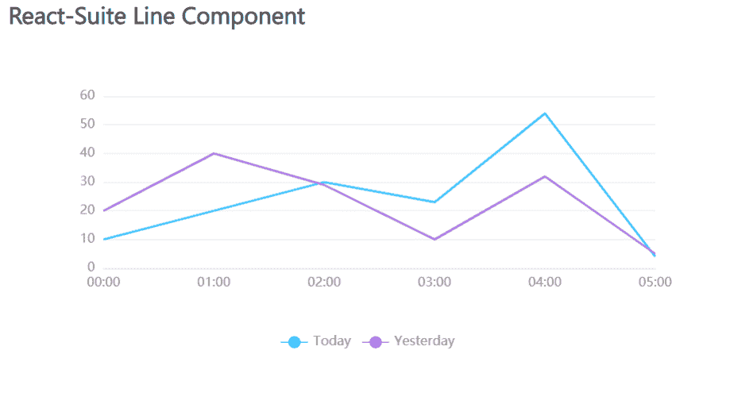

# 反应套件线组件

> 原文:[https://www.geeksforgeeks.org/react-suite-line-component/](https://www.geeksforgeeks.org/react-suite-line-component/)

React Suite Charts 是一个流行的前端库，包含一组 React 组件，用于提供一组基于 rsuite 和 echarts 的图表。线条组件有助于为图表添加不同的数据线，当我们必须在图表中显示多条线时，它就会被使用。我们可以在 ReactJS 中使用以下方法来使用 React 套件线组件。

**线路道具:**

*   **名称:**用于表示部件的名称。

**创建反应应用程序并安装模块:**

*   **步骤 1:** 使用以下命令创建一个反应应用程序:

    ```jsx
    npx create-react-app foldername
    ```

*   **步骤 2:** 在创建项目文件夹(即文件夹名**)后，使用以下命令将**移动到该文件夹:

    ```jsx
    cd foldername
    ```

*   **步骤 3:** 创建 ReactJS 应用程序后，使用以下命令安装所需的****模块:****

    ```jsx
    **npm install @rsuite/charts**
    ```

******项目结构:**如下图。****

****

项目结构**** 

******示例:**现在在 **App.js** 文件中写下以下代码。在这里，App 是我们编写代码的默认组件。****

## ****App.js****

```jsx
**import React from 'react'
import 'rsuite/dist/styles/rsuite-default.css';
import { LineChart, Line } from '@rsuite/charts';

export default function App() {

  // Sample Data
  const sampleData = [
    ['00:00', 10, 20],
    ['01:00', 20, 40],
    ['02:00', 30, 29],
    ['03:00', 23, 10],
    ['04:00', 54, 32],
    ['05:00', 4, 5],
  ];

  return (
    <div style={{
      display: 'block', width: 700, paddingLeft: 30
    }}>
      <h4>React-Suite Line Component</h4>
      <LineChart name="Multiple Lines" data={sampleData}>
        <Line name="Today" />
        <Line name="Yesterday" />
      </LineChart>
    </div>
  );
}**
```

******运行应用程序的步骤:**从项目的根目录使用以下命令运行应用程序:****

```jsx
**npm start**
```

******输出:**现在打开浏览器，转到***http://localhost:3000/***，会看到如下输出:****

********

******参考:**[https://charts . rsuitejs . com/# % E5 % A4 % 9A % E6 % 9D % A1 % E5 % 9B % BE % E7 % BA % BF](https://charts.rsuitejs.com/#%E5%A4%9A%E6%9D%A1%E5%9B%BE%E7%BA%BF)****