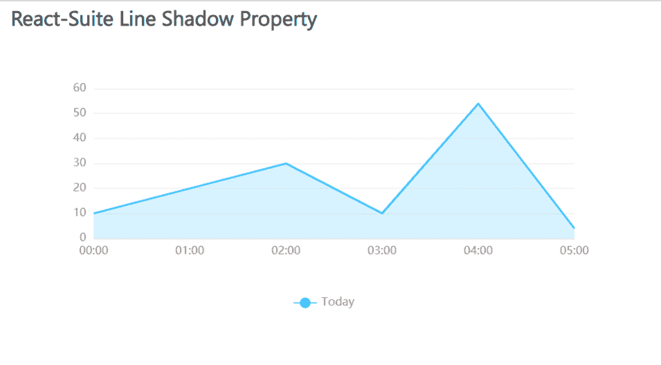

# 反应套件线影属性

> 原文:[https://www . geesforgeks . org/react-suite-line-shadow-property/](https://www.geeksforgeeks.org/react-suite-line-shadow-property/)

React Suite Charts 是一个流行的前端库，包含一组 React 组件，用于提供一组基于 rsuite 和 echarts 的图表。线条阴影属性很重要，它有助于将阴影添加到我们的图形中。

我们可以在 ReactJS 中使用以下方法来使用线阴影属性。这里我们使用折线图来演示线阴影属性。*区域*道具用于在图形中添加阴影。

**线路板建议:**

*   **名称:**用于表示图形的名称。
*   **数据:**用于传递图形的数据。
*   **区域:**如果设置为真，则用于将阴影属性添加到图形中。

**创建反应应用程序并安装模块:**

*   **步骤 1:** 使用以下命令创建一个反应应用程序:

    ```
    npx create-react-app foldername
    ```

*   **步骤 2:** 创建项目文件夹(即文件夹名**)后，使用以下命令移动到该文件夹中:**

    ```
    cd foldername
    ```

*   **步骤 3:** 创建 ReactJS 应用程序后，使用以下命令安装所需的****模块:****

    ```
    **npm install @rsuite/charts**
    ```

******项目结构:**如下图。****

****

项目结构**** 

******示例:**现在在 **App.js** 文件中写下以下代码。在这里，App 是我们编写代码的默认组件。****

## ****App.js****

```
**import React from 'react'
import 'rsuite/dist/styles/rsuite-default.css';
import { LineChart, Line } from '@rsuite/charts';

export default function App() {

  // Sample Data
  const sampleData = [
    ['00:00', 10],
    ['01:00', 20],
    ['02:00', 30],
    ['03:00', 10],
    ['04:00', 54],
    ['05:00', 4]
  ];

  return (
    <div style={{
      display: 'block', width: 700, paddingLeft: 30
    }}>
      <h4>React-Suite Line Shadow Property</h4>
      <LineChart name="Multiple Lines" data={sampleData}>
        <Line name="Today" area />
      </LineChart>
    </div>
  );
}**
```

******运行应用程序的步骤:**从项目的根目录使用以下命令运行应用程序:****

```
**npm start**
```

******输出:**现在打开浏览器，转到***http://localhost:3000/***，会看到如下输出:****

********

******参考:**[https://charts . rsejos . com/# % E5 % 9b %为% E7 % ba % BF %和 9% 98% B4 %和 5%BD%B1](https://charts.rsuitejs.com/#%E5%9B%BE%E7%BA%BF%E9%98%B4%E5%BD%B1)****