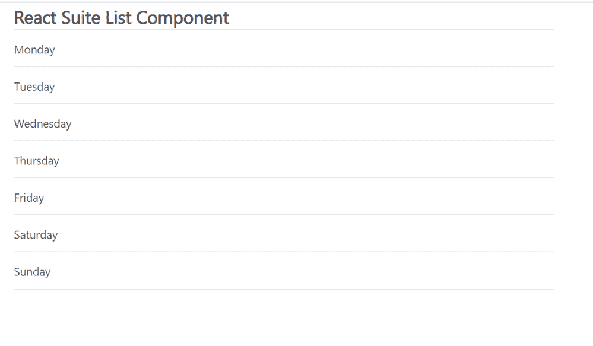

# 反应套件列表组件

> 原文:[https://www.geeksforgeeks.org/react-suite-list-component/](https://www.geeksforgeeks.org/react-suite-list-component/)

React Suite 是一个流行的前端库，包含一组为中间平台和后端产品设计的 React 组件。列表  组件允许用户显示列表。我们可以在 ReactJS 中使用以下方法来使用 React Suite 列表组件。

**列出道具:**

*   **加边:**用于加边样式。
*   **悬停:**用于悬停动画。
*   **可排序:**用于更改列表项订单。
*   **大小:**用于表示列表项的大小。
*   **自动滚动:**用于溢出时允许自动滚动。
*   **按下延时:**表示触发排序前的延时。
*   **过渡持续时间:**用于表示排序动画的持续时间。
*   **onstart:**是开始排序时触发的回调函数。
*   **onstartmove:**是在列表项上移动时触发的回调函数。
*   **onSortEnd:** 是排序结束时触发的回调函数。
*   **onstart:**是排序结束时触发的回调函数。

**列表。物品道具:**

*   **索引:**用来表示一个项目的索引。
*   **集合:**表示列表项的集合。
*   **禁用:**保证物品不允许移动。

**创建反应应用程序并安装模块:**

*   **步骤 1:** 使用以下命令创建一个反应应用程序:

    ```jsx
    npx create-react-app foldername
    ```

*   **步骤 2:** 创建项目文件夹(即文件夹名**)后，使用以下命令移动到该文件夹中:**

    ```jsx
    cd foldername
    ```

*   **步骤 3:** 创建 ReactJS 应用程序后，使用以下命令安装所需的****模块:****

    ```jsx
    **npm install rsuite**
    ```

******项目结构:**如下图。****

****

项目结构**** 

******示例:**现在在 **App.js** 文件中写下以下代码。在这里，App 是我们编写代码的默认组件。****

## ****App.js****

```jsx
**import React from 'react'
import 'rsuite/dist/styles/rsuite-default.css';
import { List } from 'rsuite';

export default function App() {

  const sampleData = ['Monday', 'Tuesday',
                      'Wednesday', 'Thursday', 
                      'Friday', 'Saturday', 'Sunday'];

  return (
    <div style={{
      display: 'block', width: 700, paddingLeft: 30
    }}>
      <h4>React Suite List Component</h4>
      <List>
        {sampleData.map((item, index) => (
          <List.Item index={index} key={index} >
            {item}
          </List.Item>
        ))}
      </List>
    </div>
  );
}**
```

******运行应用程序的步骤:**从项目的根目录使用以下命令运行应用程序:****

```jsx
**npm start**
```

******输出:**现在打开浏览器，转到***http://localhost:3000/***，会看到如下输出:****

********

******参考:**T2】https://rsuitejs.com/components/list/****