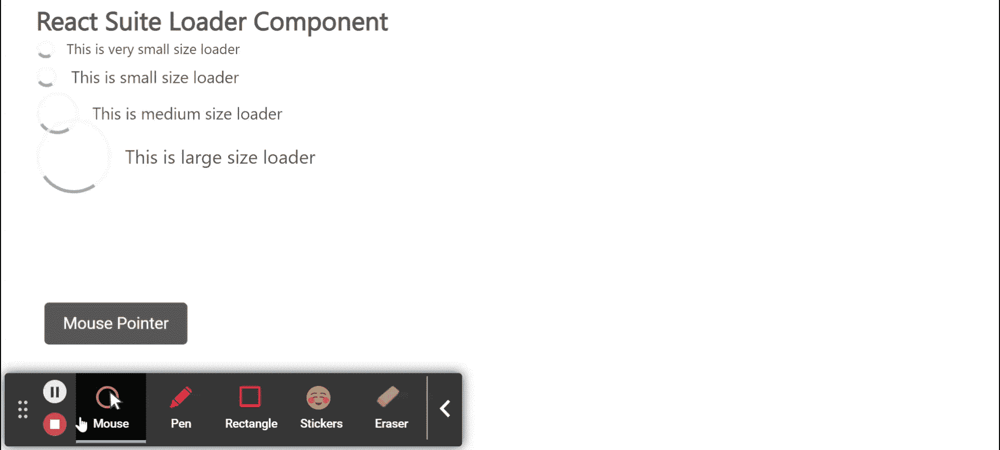

# 反应套件加载器组件

> 原文:[https://www.geeksforgeeks.org/react-suite-loader-component/](https://www.geeksforgeeks.org/react-suite-loader-component/)

React Suite 是一个流行的前端库，包含一组为中间平台和后端产品设计的 React 组件。加载器  组件允许用户显示加载效果。只要我们的应用程序需要，它就可以用来显示加载状态。我们可以在 ReactJS 中使用以下方法来使用 React Suite 加载器组件。

**装载机命题:**

*   **背景:**表示是否显示背景。
*   **居中:**用于使元件在容器中居中。
*   **类前缀:**用于表示组件 CSS 类的前缀。
*   **内容:**用于自定义描述性文本。
*   **反转:**用于表示装载机可选的深色视觉风格。
*   **尺寸:**用于设置装载机尺寸。
*   **速度:**用于表示装载机旋转的速度。
*   **垂直:**表示图标是否与文字垂直显示。

**创建反应应用程序并安装模块:**

*   **步骤 1:** 使用以下命令创建一个反应应用程序:

    ```
    npx create-react-app foldername
    ```

*   **步骤 2:** 创建项目文件夹(即文件夹名**)后，使用以下命令移动到该文件夹中:**

    ```
    cd foldername
    ```

*   **步骤 3:** 创建 ReactJS 应用程序后，使用以下命令安装所需的****模块:****

    ```
    **npm install rsuite**
    ```

******项目结构:**如下图。****

****

项目结构**** 

******示例:**现在在 **App.js** 文件中写下以下代码。在这里，App 是我们编写代码的默认组件。****

## ****App.js****

```
**import React from 'react'
import 'rsuite/dist/styles/rsuite-default.css';
import { Loader } from 'rsuite'

export default function App() {
  return (
    <div style={{
      display: 'block', width: 700, paddingLeft: 30
    }}>
      <h4>React Suite Loader Component</h4>
      <Loader size="xs" content="This is very small size loader" />
      </br>
      <Loader size="sm" content="This is small size loader" />
      </br>
      <Loader size="md" content="This is medium size loader" />
      </br>
      <Loader size="lg" content="This is large size loader" />
    </div>
  );
}**
```

******运行应用程序的步骤:**从项目的根目录使用以下命令运行应用程序:****

```
**npm start**
```

******输出:**现在打开浏览器，转到***http://localhost:3000/***，会看到如下输出:****

********

******参考:**T2】https://rsuitejs.com/components/loader/****