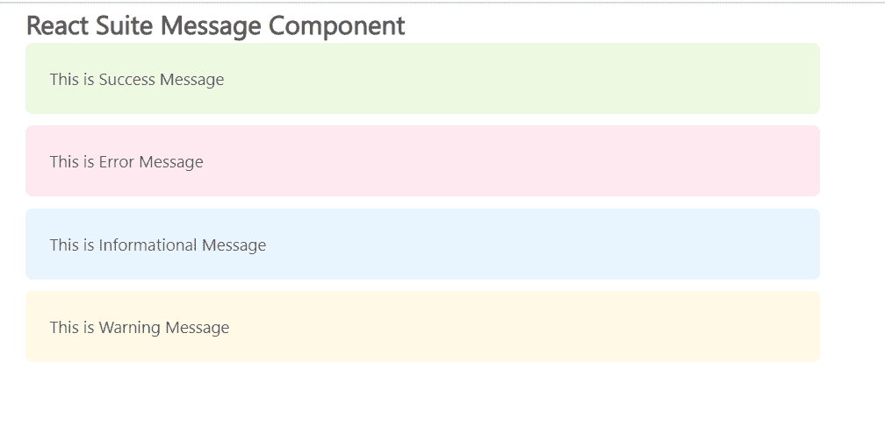

# 反应套件消息组件

> 原文:[https://www . geesforgeks . org/react-suite-message-component/](https://www.geeksforgeeks.org/react-suite-message-component/)

React Suite 是一个流行的前端库，包含一组为中间平台和后端产品设计的 React 组件。消息  组件允许用户在页面上显示重要提示。我们可以在 ReactJS 中使用以下方法来使用 React Suite 消息组件。

**消息道具:**

*   **类前缀:**用于表示组件 CSS 类的前缀。
*   **可关闭:**用于表示是否可以关闭消息框。
*   **关闭标签:**用于关闭按钮上的提示文字。
*   **描述:**用于表示消息的描述信息。
*   **充满:**用于填充容器
*   **onClose:** 是消息关闭后触发的回调函数。
*   **显示图标:**用于指示是否显示图标。
*   **标题:**用于表示消息的标题。
*   **类型:**用于表示消息框的类型。

**创建反应应用程序并安装模块:**

*   **步骤 1:** 使用以下命令创建一个反应应用程序:

    ```jsx
    npx create-react-app foldername
    ```

*   **步骤 2:** 创建项目文件夹(即文件夹名**)后，使用以下命令移动到该文件夹中:**

    ```jsx
    cd foldername
    ```

*   **步骤 3:** 创建 ReactJS 应用程序后，使用以下命令安装所需的****模块:****

    ```jsx
    **npm install rsuite**
    ```

******项目结构:**如下图。****

****

项目结构**** 

******示例:**现在在 **App.js** 文件中写下以下代码。在这里，App 是我们编写代码的默认组件。****

## ****App.js****

```jsx
**import React from 'react'
import 'rsuite/dist/styles/rsuite-default.css';
import { Message } from 'rsuite'

export default function App() {
  return (
    <div style={{
      display: 'block', width: 700, paddingLeft: 30
    }}>
      <h4>React Suite Message Component</h4>
      <Message type="success" 
               description="This is Success Message" />
      <Message type="error" 
               description="This is Error Message" />
      <Message type="info" 
               description="This is Informational Message" />
      <Message type="warning" 
               description="This is Warning Message" />
    </div>
  );
}**
```

******运行应用程序的步骤:**从项目的根目录使用以下命令运行应用程序:****

```jsx
**npm start**
```

******输出:**现在打开浏览器，转到***http://localhost:3000/***，会看到如下输出:****

********

******参考:**T2】https://rsuitejs.com/components/message/****