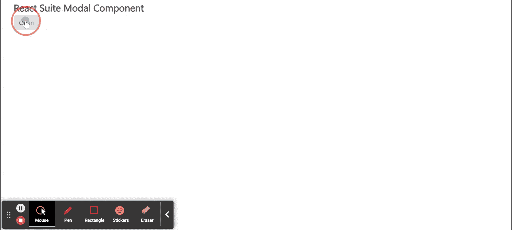

# 反应套件模态组件

> 原文:[https://www.geeksforgeeks.org/react-suite-modal-component/](https://www.geeksforgeeks.org/react-suite-modal-component/)

React Suite 是一个流行的前端库，包含一组为中间平台和后端产品设计的 React 组件。模态  组件允许用户 为创建对话框、灯箱、弹出窗口等提供坚实的基础。我们可以在 ReactJS 中使用以下方法来使用 React Suite 模态组件。

**模态道具:**

*   **自动对焦:**当设置为真时，模式会打开并自动对焦。
*   **背景:**当设置为真时，模式将显示处于打开状态的背景。
*   **backdropbclassname:**用于为*增加一个可选的额外类名。模态背景*。
*   **类前缀:**用于表示组件 CSS 类的前缀。
*   **dialogClassName:** 用于应用于 Dialog DOM 节点的 CSS 类。
*   **dialogComponentClass:** 可用于 Dialog 的自定义元素类型。
*   **强制焦点:**当设置为真时，模式将防止焦点在打开时离开。
*   **满:**用于全屏。
*   **键盘:**按下 ESC 键时关闭模式。
*   **onEnter:** 它是一个回调函数，在模态转换之前被触发。
*   **OneHinded:**它是一个回调函数，在 Modal 完成转换后被触发。
*   **OnLining:**它是一个回调函数，当模态开始转换时被触发。
*   **onExit:** 它是一个回调函数，在模态转换之前被触发。
*   **onexitted:**它是一个回调函数，在 Modal 完成转换后被触发。
*   **onExiting:** 是一个回调函数，在 Modal 开始向外过渡时触发。
*   **onHide:** 是 Modal 隐藏时触发的回调函数。
*   **onShow:** 是一个回调函数，在 Modal 显示时触发。
*   **溢出:**当正文内容过长时自动设置高度。
*   **显示:**用于显示情态。
*   **尺寸:**用于设置模态尺寸。

**情态。标题道具:**

*   **类前缀:**用于表示组件 CSS 类的前缀。
*   **关闭按钮:**用于显示关闭按钮。
*   **onHide:** 是隐藏 Modal 时触发的回调函数。

**情态。标题道具:**

*   **类前缀:**用于表示组件 CSS 类的前缀。

**情态。页脚道具:**

*   **类前缀:**用于表示组件 CSS 类的前缀。

**情态。身体道具:**

*   **类前缀:**用于表示组件 CSS 类的前缀。

**创建反应应用程序并安装模块:**

*   **步骤 1:** 使用以下命令创建一个反应应用程序:

    ```
    npx create-react-app foldername
    ```

*   **步骤 2:** 创建项目文件夹(即文件夹名**)后，使用以下命令移动到该文件夹中:**

    ```
    cd foldername
    ```

*   **步骤 3:** 创建 ReactJS 应用程序后，使用以下命令安装所需的****模块:****

    ```
    **npm install rsuite**
    ```

******项目结构:**如下图。****

****

项目结构**** 

******示例:**现在在 **App.js** 文件中写下以下代码。在这里，App 是我们编写代码的默认组件。****

## ****App.js****

```
**import React from 'react'
import 'rsuite/dist/styles/rsuite-default.css';
import { Button, Modal } from 'rsuite';

export default function App() {

  const [show, setShow] = React.useState(false)

  // Function to open Modal
  const close = () => {
    setShow(false);
  }

  // Function to close Modal
  const open = () => {
    setShow(true);
  }

  return (
    <div style={{
      display: 'block', width: 700, paddingLeft: 30
    }}>
      <h4>React Suite Modal Component</h4>
      <Button onClick={open}> Open</Button>

      <Modal show={show} onHide={close}>
        <Modal.Header>
          <Modal.Title>Sampple Modal Title</Modal.Title>
        </Modal.Header>
        <Modal.Body>
          Greetings from GeeksforGeeks
        </Modal.Body>
        <Modal.Footer>
          <Button onClick={close} appearance="primary">
           Confirm
          </Button>
          <Button onClick={close} appearance="subtle">
           Cancel
          </Button>
        </Modal.Footer>
      </Modal>
    </div>
  );
}**
```

******运行应用程序的步骤:**从项目的根目录使用以下命令运行应用程序:****

```
**npm start**
```

******输出:**现在打开浏览器，转到***http://localhost:3000/***，会看到如下输出:****

********

******参考:**T2】https://rsuitejs.com/components/modal/****