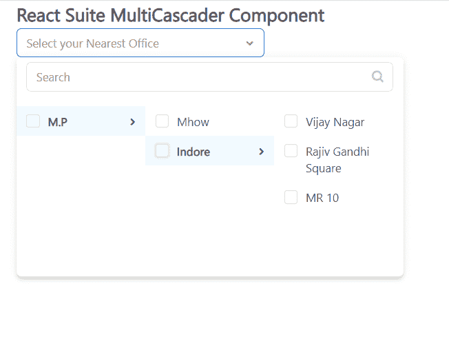

# 反应套件多通道组件

> 原文:[https://www . geeksforgeeks . org/react-suite-multicascader-component/](https://www.geeksforgeeks.org/react-suite-multicascader-component/)

React Suite 是一个流行的前端库，包含一组为中间平台和后端产品设计的 React 组件。多分类器组件帮助用户在中选择具有层次关系结构的单一数据。我们可以在 ReactJS 中使用以下方法来使用 React Suite MultiCascader 组件。

**多级推进剂 Props:**

*   **外观:**用于组件外观。
*   **块:**用于块整行。
*   **级联:**表示是否级联选择。
*   **子键:**用于设置数据中的子键。
*   **类前缀:**用于表示组件 CSS 类的前缀。
*   **可清洗:**用于指示选项是否可以清空。
*   **容器:**用于设置渲染容器。
*   **可数:**用于对选择的选项进行计数。
*   **数据:**用于表示可选数据。
*   **defaultOpen:** 用于表示 Open 属性的默认值。
*   **默认值:**用于表示默认值。
*   **禁用:**表示组件是否禁用。
*   **disableItemValues:**用于禁用可选。
*   **高度:**用于表示菜单高度。
*   **lnline:** 用于组件初始化时直接显示菜单。
*   **标签页:**用于设置显示“数据”中“键”的选项。
*   **菜单八:**用于设置菜单的高度。
*   **菜单宽度:**用于设置菜单的宽度。
*   **onChange:** 是一个回调函数，当值发生变化时触发。
*   **onClean:** 是值清空时触发的回调函数。
*   **onClose:** 是关闭事件触发的回调函数。
*   **onEnter:** 是一个回调函数，在叠加转换之前触发。
*   **OneHinded:**这是一个回调函数，在覆盖完成转换后触发。
*   **OnLining:**这是一个回调函数，当覆盖开始转换时被触发。
*   **onExit:** 它是一个回调函数，在覆盖转换之前被触发。
*   **onexitted:**是一个回调函数，在覆盖完成转换后触发。
*   **onExiting:** 是一个回调函数，在叠加开始向外过渡时触发。
*   **onOpen:** 是组件打开时触发的回调函数。
*   **onSearch:** 是搜索的回调函数。
*   **onSelect:** 是一个回调函数，在选择一个选项时触发。
*   **打开:**表示是否打开组件。
*   **占位符:**用于表示占位符。
*   **放置:**用于元件的放置。
*   **preventOverflow:** 用于防止浮动元素溢出。
*   **渲染额外页脚:**用于自定义渲染额外页脚。
*   **渲染菜单:**用于自定义渲染菜单列表。
*   **渲染菜单项:**用于自定义渲染菜单项
*   **渲染值:**用于自定义渲染选定选项。
*   **可搜索:**用于表示是否可以搜索选项。
*   **尺寸:**用于表示采摘器尺寸。
*   **toggleComponentClass:** 可用于该组件的自定义元素。
*   **取消勾选项目值:**用于设置不渲染复选框的选项值。
*   **值:**用于表示值(受控)。
*   **valueKey:** 用于设置“数据”中的选项值‘key’。

**创建反应应用程序并安装模块:**

*   **步骤 1:** 使用以下命令创建一个反应应用程序:

    ```
    npx create-react-app foldername
    ```

*   **步骤 2:** 创建项目文件夹(即文件夹名**)后，使用以下命令移动到该文件夹中:**

    ```
    cd foldername
    ```

*   **步骤 3:** 创建 ReactJS 应用程序后，使用以下命令安装所需的****模块:****

    ```
    **npm install rsuite**
    ```

******项目结构:**如下图。****

****

项目结构**** 

******示例:**现在在 **App.js** 文件中写下以下代码。在这里，App 是我们编写代码的默认组件。****

## ****App.js****

```
**import React from 'react'
import 'rsuite/dist/styles/rsuite-default.css';
import { MultiCascader } from 'rsuite';

export default function App() {

  // Sample Options
  const options = [
    {
      "label": "M.P",
      "value": 1,
      "children": [
        {
          "label": "Mhow",
          "value": 2
        },
        {
          "label": "Indore",
          "value": 3,
          "children": [
            {
              "label": "Vijay Nagar",
              "value": 4
            },
            {
              "label": "Rajiv Gandhi Square",
              "value": 5
            },
            {
              "label": "MR 10",
              "value": 6
            },
          ]
        },
      ]
    }
  ]

  return (
    <div style={{
      display: 'block', width: 600, paddingLeft: 30
    }}>
      <h4>React Suite MultiCascader Component</h4>
      <MultiCascader
        style={{ width: 300 }}
        placeholder="Select your Nearest Office"
        data={options}
      />
    </div>
  );
}**
```

******运行应用程序的步骤:**从项目的根目录使用以下命令运行应用程序:****

```
**npm start**
```

******输出:**现在打开浏览器，转到***http://localhost:3000/***，会看到如下输出:****

********

******参考:**T2】https://rsuitejs.com/components/multi-cascader/****