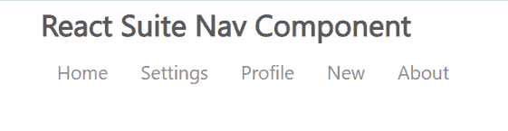

# 反应套件导航组件

> 原文:[https://www.geeksforgeeks.org/react-suite-nav-component/](https://www.geeksforgeeks.org/react-suite-nav-component/)

React Suite 是一个流行的前端库，包含一组为中间平台和后端产品设计的 React 组件。导航  组件允许用户 p 提供各种形式的导航菜单列表。我们可以在 ReactJS 中使用以下方法来使用 React Suite 导航组件。

**导航道具:**

*   **激活键:**用于表示*导航中*事件键*对应的激活键。第*项。
*   **外观:**用于导航外观。
*   **儿童:**用于表示成分的含量。
*   **类前缀:**用于表示组件 CSS 类的前缀。
*   **正当化:**用于正当化导航。
*   **onSelect:** 是选择后触发的回调函数。
*   **药丸:**表示药丸导航。
*   **向右拉:**用于使其出现在右侧。
*   **堆叠:**用于堆叠导航。

**导航。物品道具:**

*   **激活:**用于表示激活状态。
*   **儿童:**用于表示成分的含量。
*   **componentClass:** 可用于该组件的自定义元素类型。
*   **禁用:**用于禁用状态。
*   **href:** 用来表示超链接。
*   **图标:**用于设置组件的图标。
*   **onSelect:** 是选择任意一项后触发的回调函数。
*   **渲染项:**用于自定义渲染项。

**创建反应应用程序并安装模块:**

*   **步骤 1:** 使用以下命令创建一个反应应用程序:

    ```jsx
    npx create-react-app foldername
    ```

*   **步骤 2:** 创建项目文件夹(即文件夹名**)后，使用以下命令移动到该文件夹中:**

    ```jsx
    cd foldername
    ```

*   **步骤 3:** 创建 ReactJS 应用程序后，使用以下命令安装所需的****模块:****

    ```jsx
    **npm install rsuite**
    ```

******项目结构:**如下图。****

****

项目结构**** 

******示例:**现在在 **App.js** 文件中写下以下代码。在这里，App 是我们编写代码的默认组件。****

## ****App.js****

```jsx
**import React from 'react'
import 'rsuite/dist/styles/rsuite-default.css';
import { Nav } from 'rsuite';

export default function App() {

  return (
    <div style={{
      display: 'block', width: 700, paddingLeft: 30
    }}>
      <h4>React Suite Nav Component</h4>
      <Nav>
        <Nav.Item>Home</Nav.Item>
        <Nav.Item>Settings</Nav.Item>
        <Nav.Item>Profile</Nav.Item>
        <Nav.Item>New</Nav.Item>
        <Nav.Item>About</Nav.Item>
      </Nav>
    </div>
  );
}**
```

******运行应用程序的步骤:**从项目的根目录使用以下命令运行应用程序:****

```jsx
**npm start**
```

******输出:**现在打开浏览器，转到***http://localhost:3000/***，会看到如下输出:****

********

******参考:**T2】https://rsuitejs.com/components/nav/****