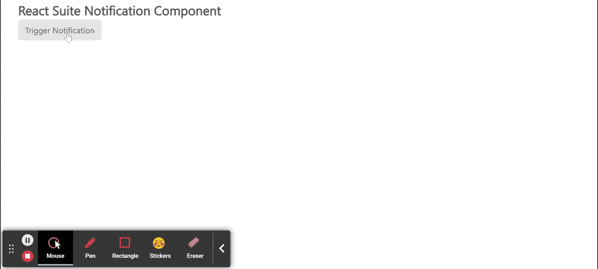

# 反应套件通知组件

> 原文:[https://www . geesforgeks . org/react-suite-notification-component/](https://www.geeksforgeeks.org/react-suite-notification-component/)

React Suite 是一个流行的前端库，包含一组为中间平台和后端产品设计的 React 组件。通知组件允许用户全局显示通知消息。我们可以在 ReactJS 中使用以下方法来使用 React Suite 通知组件。

**通知道具:**

*   **底部:**用于表示离消息框底部的距离。
*   **描述:**用于表示消息框的描述。
*   **时长:**用于表示消息框时长。
*   **键:**用于表示唯一标识消息框的键。
*   **onClose:** 它是一个回调函数，在关闭通知框时调用。
*   **放置:**用于放置消息框。
*   **标题:**用于表示消息框的标题。
*   **顶部:**用于表示离消息框顶部的距离。

**通知方式:**

*   **通知打开:**此方法用于打开默认通知。
*   **通知信息:**此方法用于打开信息通知。
*   **通知成功:**此方法用于打开成功信息通知。
*   **通知.警告:**此方法用于打开警告信息通知。
*   **通知。错误:**此方法用于打开错误信息通知。
*   **通知关闭:**此方法用于关闭通知。
*   **通知.关闭所有:**此方法用于关闭所有通知。

**创建反应应用程序并安装模块:**

*   **步骤 1:** 使用以下命令创建一个反应应用程序:

    ```jsx
    npx create-react-app foldername
    ```

*   **步骤 2:** 创建项目文件夹(即文件夹名**)后，使用以下命令移动到该文件夹中:**

    ```jsx
    cd foldername
    ```

*   **步骤 3:** 创建 ReactJS 应用程序后，使用以下命令安装所需的****模块:****

    ```jsx
    **npm install rsuite**
    ```

******项目结构:**如下图。****

****

项目结构**** 

******示例:**现在在 **App.js** 文件中写下以下代码。在这里，App 是我们编写代码的默认组件。****

## ****App.js****

```jsx
**import React from 'react'
import 'rsuite/dist/styles/rsuite-default.css';
import { Notification, Button } from 'rsuite'

export default function App() {
  return (
    <div style={{
      display: 'block', width: 700, paddingLeft: 30
    }}>
      <h4>React Suite Notification Component</h4>
      <Button
        onClick={() => {
          Notification.open({
            title: 'Notify',
            description: 'I am sample Notification Message!'
          });
        }}
      > Trigger Notification </Button>
    </div>
  );
}**
```

******运行应用程序的步骤:**从项目的根目录使用以下命令运行应用程序:****

```jsx
**npm start**
```

******输出:**现在打开浏览器，转到***http://localhost:3000/***，会看到如下输出:****

********

******参考:**T2】https://rsuitejs.com/components/notification/****