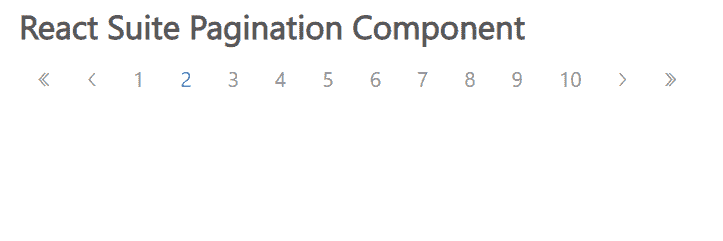

# 反应套件分页组件

> 原文:[https://www . geesforgeks . org/react-suite-paging-component/](https://www.geeksforgeeks.org/react-suite-pagination-component/)

React Suite 是一个流行的前端库，包含一组为中间平台和后端产品设计的 React 组件。分页  组件允许用户 从一系列页面中选择特定页面。 我们可以在 ReactJS 中使用以下方法来使用 React Suite 分页组件。

**页码命题:**

*   **活动页面:**用于表示当前页码。
*   **边框链接:**用于显示边框分页按钮 1 和页面。
*   **按钮组件类:**用于自定义组件的元素类型。
*   **类前缀:**用于表示组件 CSS 类的前缀。
*   **禁用:**用于禁用组件。
*   **省略号:**用于显示省略号。
*   **首先:**用于显示首页。
*   **最后:**用于显示最后一页。
*   **最大按钮:**用于表示页面按钮的最大数量。
*   **下一页:**用于显示下一页。
*   **页数:**用来表示页数。
*   **prev:** 用于显示上一页。

**创建反应应用程序并安装模块:**

*   **步骤 1:** 使用以下命令创建一个反应应用程序:

    ```
    npx create-react-app foldername
    ```

*   **步骤 2:** 在创建项目文件夹(即文件夹名**)后，使用以下命令将**移动到该文件夹:

    ```
    cd foldername
    ```

*   **步骤 3:** 创建 ReactJS 应用程序后，使用以下命令安装所需的****模块:****

    ```
    **npm install rsuite**
    ```

******项目结构:**如下图。****

****

项目结构**** 

******示例:**现在在 **App.js** 文件中写下以下代码。在这里，App 是我们编写代码的默认组件。****

## ****App.js****

```
**import React from 'react'
import 'rsuite/dist/styles/rsuite-default.css';
import { Pagination } from 'rsuite'

export default function App() {

  return (
    <div style={{
      display: 'block', width: 700, paddingLeft: 30
    }}>
      <h4>React Suite Pagination Component</h4>
      <Pagination
        prev
        last
        next
        first
        size="md"
        pages={10}
        activePage={2}
        onSelect={()=> {console.log("Selected!")}}
      />
    </div>
  );
}**
```

******运行应用程序的步骤:**从项目的根目录使用以下命令运行应用程序:****

```
**npm start**
```

******输出:**现在打开浏览器，转到***http://localhost:3000/***，会看到如下输出:****

********

******参考:**T2】https://rsuitejs.com/components/pagination/****