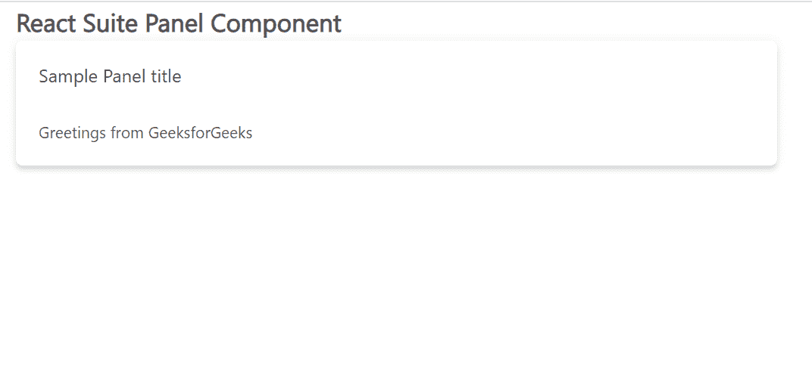

# 反应套件面板组件

> 原文:[https://www.geeksforgeeks.org/react-suite-panel-component/](https://www.geeksforgeeks.org/react-suite-panel-component/)

React Suite 是一个流行的前端库，包含一组为中间平台和后端产品设计的 React 组件。面板  组件允许用户显示支持折叠面板的内容面板。我们可以在 ReactJS 中使用以下方法来使用 React Suite 面板组件。

**面板道具:**

*   **bodyFill:** 用于确保内容区域装满容器。
*   **加边框:**用于显示带边框的面板。
*   **阴影:**用于显示有阴影的面板。
*   **类前缀:**用于表示组件 CSS 类的前缀。
*   **可折叠:**用于表示是否为可折叠面板。
*   **默认展开:**默认用于展开面板。
*   **事件键:**表示面板对应的事件键。
*   **展开:**用于展开面板。
*   **表头:**用于让表头显示信息。
*   **id:** 用来表示唯一的 id。

**面板组道具:**

*   **手风琴:**用于表示是否为可折叠面板。
*   **活动键:**用于表示潘德尔中对应*事件键*的活动键。
*   **类前缀:**用于表示组件 CSS 类的前缀。
*   **defaultActiveKey:** 用于表示默认的扩展面板。
*   **onSelect:** 这是一个用于切换展开面板的回调函数。

**创建反应应用程序并安装模块:**

*   **步骤 1:** 使用以下命令创建一个反应应用程序:

    ```jsx
    npx create-react-app foldername
    ```

*   **步骤 2:** 在创建项目文件夹(即文件夹名**)后，使用以下命令将**移动到该文件夹:

    ```jsx
    cd foldername
    ```

*   **步骤 3:** 创建 ReactJS 应用程序后，使用以下命令安装所需的****模块:****

    ```jsx
    **npm install rsuite**
    ```

******项目结构:**如下图。****

****

项目结构**** 

******示例:**现在在 **App.js** 文件中写下以下代码。在这里，App 是我们编写代码的默认组件。****

## ****App.js****

```jsx
**import React from 'react'
import 'rsuite/dist/styles/rsuite-default.css';
import { Panel } from 'rsuite';

export default function App() {

  return (
    <div style={{
      display: 'block', width: 700, paddingLeft: 30
    }}>
      <h4>React Suite Panel Component</h4>
      <Panel header="Sample Panel title" shaded>
        Greetings from GeeksforGeeks
      </Panel>
    </div>
  );
}**
```

******运行应用程序的步骤:**从项目的根目录使用以下命令运行应用程序:****

```jsx
**npm start**
```

******输出:**现在打开浏览器，转到***http://localhost:3000/***，会看到如下输出:****

********

******参考:**T2】https://rsuitejs.com/components/panel/****