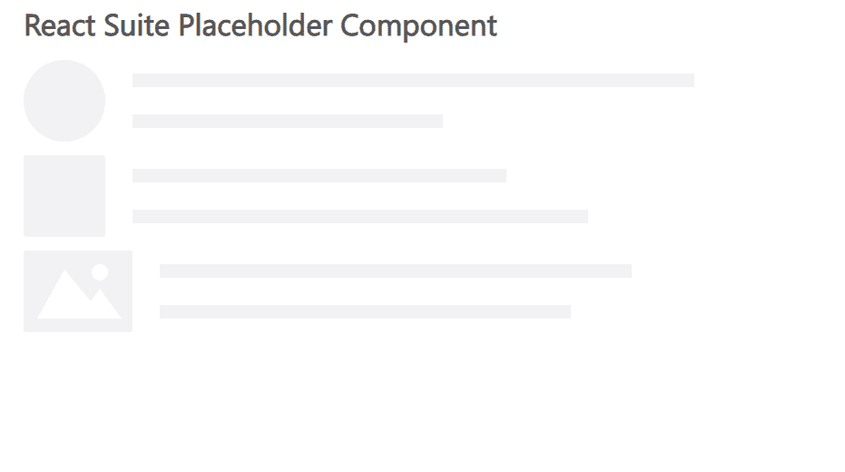

# 反应套件占位符组件

> 原文:[https://www . geesforgeks . org/react-suite-placeholder-component/](https://www.geeksforgeeks.org/react-suite-placeholder-component/)

React Suite 是一个流行的前端库，包含一组为中间平台和后端产品设计的 React 组件。占位符  组件允许用户在加载组件之前显示初始状态 。 我们可以在 ReactJS 中使用以下方法来使用 React Suite 占位符组件。

**占位符。段落道具**

*   **行数:**用于表示行数。
*   **行高:**用来表示行高。
*   **行边距:**用来表示行的边距。
*   **图形:**用于显示图形。
*   **激活:**用于播放动画。

**占位符。格子道具**

*   **行数:**用于表示行数。
*   **列:**用于表示列数。
*   **行高:**用来表示行高。
*   **行边距:**用来表示行的边距。
*   **激活:**用于播放动画。

**占位符。图形道具**

*   **宽度:**用于表示图形宽度。
*   **高度:**用于表示图形高度。
*   **激活:**用于播放动画。

**创建反应应用程序并安装模块:**

*   **步骤 1:** 使用以下命令创建一个反应应用程序:

    ```
    npx create-react-app foldername
    ```

*   **步骤 2:** 创建项目文件夹(即文件夹名**)后，使用以下命令移动到该文件夹中:**

    ```
    cd foldername
    ```

*   **步骤 3:** 创建 ReactJS 应用程序后，使用以下命令安装所需的****模块:****

    ```
    **npm install rsuite**
    ```

******项目结构:**如下图。****

****

项目结构**** 

******示例:**现在在 **App.js** 文件中写下以下代码。在这里，App 是我们编写代码的默认组件。****

## ****App.js****

```
**import React from 'react'
import 'rsuite/dist/styles/rsuite-default.css';
import { Placeholder } from 'rsuite'

const { Paragraph } = Placeholder;

export default function App() {

  return (
    <div style={{
      display: 'block', width: 700, paddingLeft: 30
    }}>
      <h4>React Suite Placeholder Component</h4>
      <Paragraph style={{ marginTop: 10 }} graph="circle" />
      <Paragraph style={{ marginTop: 10 }} graph="square" />
      <Paragraph style={{ marginTop: 10 }} graph="image" />
    </div>
  );
}**
```

******运行应用程序的步骤:**从项目的根目录使用以下命令运行应用程序:****

```
**npm start**
```

******输出:**现在打开浏览器，转到***http://localhost:3000/***，会看到如下输出:****

********

******参考:**T2】https://rsuitejs.com/components/placeholder/****