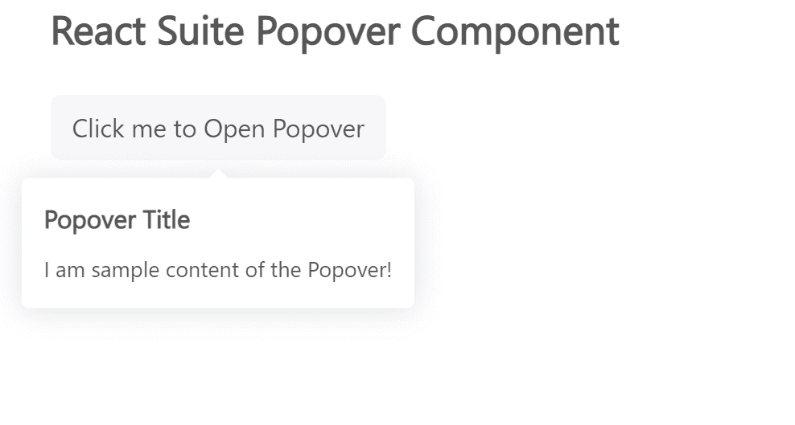

# 反应套件 Popover 组件

> 原文:[https://www . geesforgeks . org/react-suite-Popo ver-component/](https://www.geeksforgeeks.org/react-suite-popover-component/)

React Suite 是一个流行的前端库，包含一组为中间平台和后端产品设计的 React 组件。弹出组件允许用户在父窗口上显示某个事件触发的弹出信息。我们可以在 ReactJS 中使用以下方法来使用 React Suite Popover 组件。

**Popover 道具:**

*   **儿童:**用于表示成分的含量。
*   **类前缀:**用于表示组件 CSS 类的前缀。
*   **标题:**用于表示部件的标题。
*   **可见:**用于表示默认情况下组件可见。

**耳语道具:**

*   **容器:**用于设置渲染容器。
*   **延迟:**用于表示延迟时间。
*   **延迟时间:**用于表示隐藏的延迟时间。
*   **延迟显示:**用于表示演出延迟时间。
*   **可输入:**用于表示触发值设置为悬停时，是否允许鼠标进入 popover 的浮动层。
*   **装满:**用于表示容器中的内容物装满。
*   **onbulr:**是失去焦点时触发的回调函数。
*   **onClick:** 是点击事件触发的回调函数。
*   **onClose:** 是关闭组件时触发的回调函数。
*   **onEnter:** 是一个回调函数，在叠加转换之前触发。
*   **OneHinded:**这是一个回调函数，在覆盖完成转换后触发。
*   **OnLining:**这是一个回调函数，当覆盖开始转换时触发。
*   **onExit:** 它是一个回调函数，在覆盖转换之前被触发。
*   **onexitted:**是一个回调函数，在覆盖完成转换后触发。
*   **onExiting:** 是一个回调函数，当叠加开始向外过渡时触发。
*   **onFocus:** 是获取焦点的回调函数。
*   **onMouseOut:** 是鼠标离开事件触发的回调函数。
*   **onOpen:** 是一个回调函数，当组件打开时触发。
*   **放置:**用于组件的放置。
*   **preventOverflow:** 用于防止浮动元素溢出。
*   **扬声器:**用于显示组件。
*   **触发:**用于触发事件。
*   **触发器参考:**用于表示触发器的参考。

**耳语方法:**

*   **打开:**是用于显示弹出窗口的功能。
*   **关闭:**是用来隐藏 popover 的功能。

**创建反应应用程序并安装模块:**

*   **步骤 1:** 使用以下命令创建一个反应应用程序:

    ```jsx
    npx create-react-app foldername
    ```

*   **步骤 2:** 在创建项目文件夹(即文件夹名**)后，使用以下命令将**移动到该文件夹:

    ```jsx
    cd foldername
    ```

*   **步骤 3:** 创建 ReactJS 应用程序后，使用以下命令安装所需的****模块:****

    ```jsx
    **npm install rsuite**
    ```

******项目结构:**如下图。****

****

项目结构**** 

******示例:**现在在 **App.js** 文件中写下以下代码。在这里，App 是我们编写代码的默认组件。****

## ****App.js****

```jsx
**import React from 'react'
import 'rsuite/dist/styles/rsuite-default.css';
import { Popover, Whisper, Button } from 'rsuite';

export default function App() {

  return (
    <div style={{
      display: 'block', width: 600, paddingLeft: 30
    }}>
      <h4>React Suite Popover Component</h4> <br></br>
      <Whisper
        trigger="click"
        placement='bottom'
        speaker={
          <Popover title="Popover Title">
            <p>I am sample content of the Popover!</p>

          </Popover>
        }
      >
        <Button appearance="subtle">
          Click me to Open Popover
        </Button>
      </Whisper>
    </div>
  );
}**
```

******运行应用程序的步骤:**从项目的根目录使用以下命令运行应用程序:****

```jsx
**npm start**
```

******输出:**现在打开浏览器，转到***http://localhost:3000/***，会看到如下输出:****

********

******参考:**T2】https://rsuitejs.com/components/popover/****