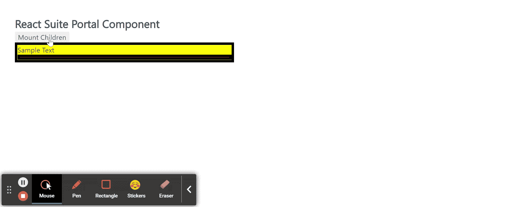

# 反应套件门户组件

> 原文:[https://www.geeksforgeeks.org/react-suite-portal-component/](https://www.geeksforgeeks.org/react-suite-portal-component/)

React Suite 是一个流行的前端库，包含一组为中间平台和后端产品设计的 React 组件。P 门户组件将其子组件渲染到当前 DOM 层次结构外的新*子树*中。 我们可以在 ReactJS 中使用以下方法来使用 React Suite 门户组件。

**门户道具:**

*   **儿童:**用来表示子成分。
*   **容器:**用于表示渲染子组件容器。
*   **onRendered:** 用于表示渲染的回调函数。

**创建反应应用程序并安装模块:**

*   **步骤 1:** 使用以下命令创建一个反应应用程序:

    ```jsx
    npx create-react-app foldername
    ```

*   **步骤 2:** 创建项目文件夹(即文件夹名**)后，使用以下命令移动到该文件夹中:**

    ```jsx
    cd foldername
    ```

*   **步骤 3:** 创建 ReactJS 应用程序后，使用以下命令安装所需的****模块:****

    ```jsx
    **npm install rsuite**
    ```

******项目结构:**如下图。****

****

项目结构**** 

******示例:**现在在 **App.js** 文件中写下以下代码。在这里，App 是我们编写代码的默认组件。****

## ****App.js****

```jsx
**import React from 'react'
import 'rsuite/dist/styles/rsuite-default.css';
import { Portal } from 'rsuite';

export default function App() {

  // State to handle visibility
  const [isVisible, setVisibility] = React.useState(false);

  // Box Ref
  const box = React.useRef(null);

  return (
    <div style={{ display: 'block', padding: 30, width: 500 }}>
      <h4>React Suite Portal Component</h4>
      <button type="button" onClick={() => setVisibility(!isVisible)}>
        {!isVisible ? 'Mount Children' : 'Unmount Children'}
      </button>
      <div style={{
        backgroundColor: 'yellow',
        border: '5px solid black',
      }}>
        Sample Text
        {isVisible ? (
          <Portal container={box.current}>
            <span>Your Data is Mounted here :)</span>
          </Portal>
        ) : null}
        <div style={{
          backgroundColor: 'orange',
          border: '5px solid black',
        }} ref={box} />
      </div>
    </div>
  )
}**
```

******运行应用程序的步骤:**从项目的根目录使用以下命令运行应用程序:****

```jsx
**npm start**
```

******输出:**现在打开浏览器，转到***http://localhost:3000/***，会看到如下输出:****

********

******参考:**T2】https://rsuitejs.com/components/portal/****