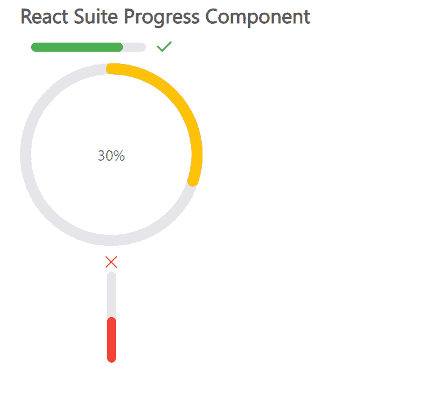

# 反应套件进度组件

> 原文:[https://www . geesforgeks . org/react-suite-progress-component/](https://www.geeksforgeeks.org/react-suite-progress-component/)

React Suite 是一个流行的前端库，包含一组为中间平台和后端产品设计的 React 组件。进度  组件允许用户显示操作流程的当前进度。我们可以在 ReactJS 中使用以下方法来使用 React Suite 进度组件。

**进步。线路道具:**

*   **类前缀:**用于表示组件 CSS 类的前缀
*   **百分比:**用于设置完成百分比。
*   **显示信息:**表示是否显示文字。
*   **状态:**用于设置进度的状态。
*   **strokeColor:** 用于表示线条颜色。
*   **线宽:**用于设置线宽。
*   **垂直:**进度条垂直显示。

**进步。圆圈道具:**

*   **类前缀:**用于表示组件 CSS 类的前缀
*   **间隙度:**用于表示半圆的间隙度。
*   **间隙位置:**用于表示间隙位置。
*   **百分比:**用于设置完成百分比。
*   **显示信息:**表示是否显示文字。
*   **状态:**用于设置进度的状态。
*   **strokeColor:** 用于表示线条颜色。
*   **strokeLinecap:** 用于表示不同类型开放路径的终点
*   **线宽:**用于设置线宽。
*   **trailColor:** 用于设置未填充部分的颜色。
*   **轨迹:**用于设置未填充部分的宽度。

**创建反应应用程序并安装模块:**

*   **步骤 1:** 使用以下命令创建一个反应应用程序:

    ```
    npx create-react-app foldername
    ```

*   **步骤 2:** 在创建项目文件夹(即文件夹名**)后，使用以下命令将**移动到该文件夹:

    ```
    cd foldername
    ```

*   **步骤 3:** 创建 ReactJS 应用程序后，使用以下命令安装所需的****模块:****

    ```
    **npm install rsuite**
    ```

******项目结构:**如下图。****

****

项目结构**** 

******示例:**现在在 **App.js** 文件中写下以下代码。在这里，App 是我们编写代码的默认组件。****

## ****App.js****

```
**import React from 'react'
import 'rsuite/dist/styles/rsuite-default.css';
import { Progress } from 'rsuite'

const { Line, Circle } = Progress

export default function App() {

  return (
    <div style={{
      display: 'block', width: 700, paddingLeft: 30
    }}>
      <h4>React Suite Progress Component</h4>
      <div style={{ width: 200 }}>
        <Line percent={80} status='success' />
        <Circle percent={30} strokeColor="#ffc107" />
        <Line vertical percent={50} status="fail" />
      </div>
    </div>
  );
}**
```

******运行应用程序的步骤:**从项目的根目录使用以下命令运行应用程序:****

```
**npm start**
```

******输出:**现在打开浏览器，转到***http://localhost:3000/***，会看到如下输出:****

********

******参考:**T2】https://rsuitejs.com/components/progress/****