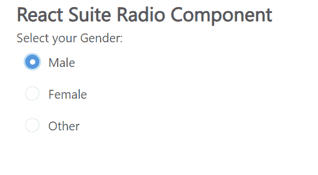

# 反应套件无线电组件

> 原文:[https://www.geeksforgeeks.org/react-suite-radio-component/](https://www.geeksforgeeks.org/react-suite-radio-component/)

React Suite 是一个流行的前端库，包含一组为中间平台和后端产品设计的 React 组件。收音机  组件允许用户 允许用户从一组中选择一个选项。 我们可以在 ReactJS 中使用以下方法来使用 React Suite 无线电组件。

**无线电道具:**

*   **已检查:**表示收音机是否被选择。
*   **缺省检查:**用于指定是否选择收音机的初始状态。
*   **禁用:**当设置为真时，用于禁用收音机。
*   **内联:**用于内联布局。
*   **inputRef:** 用于表示输入元素的 Ref。
*   **名称:**用于表示无线电组件的名称属性。
*   **onChange:** 是状态变化时触发的回调函数。
*   **标题:**用来表示 HTML 标题。
*   **值:**用于表示 RadioGroup 的值。

**RadioGroup 道具:**

*   **外观:**用于电台组外观。
*   **默认值:**用于表示默认值。
*   **内联:**用于内联布局。
*   **名称:**用于表示电台的名称属性。
*   **onChange:** 是状态变化时触发的回调函数。
*   **值:**用于表示收音机(受控)的值。

**创建反应应用程序并安装模块:**

*   **步骤 1:** 使用以下命令创建一个反应应用程序:

    ```
    npx create-react-app foldername
    ```

*   **步骤 2:** 在创建项目文件夹(即文件夹名**)后，使用以下命令将**移动到该文件夹:

    ```
    cd foldername
    ```

*   **步骤 3:** 创建 ReactJS 应用程序后，使用以下命令安装所需的****模块:****

    ```
    **npm install rsuite**
    ```

******项目结构:**如下图。****

****

项目结构**** 

******示例:**现在在 **App.js** 文件中写下以下代码。在这里，App 是我们编写代码的默认组件。****

## ****App.js****

```
**import React from 'react'
import 'rsuite/dist/styles/rsuite-default.css';
import { Radio, RadioGroup } from 'rsuite';

export default function App() {

  return (
    <div style={{
      display: 'block', width: 700, paddingLeft: 30
    }}>
      <h4>React Suite Radio Component</h4>
      Select your Gender:
      <RadioGroup name="gender">
        <Radio value="Male">Male</Radio>
        <Radio value="Female">Female</Radio>
        <Radio value="Other">Other</Radio>
      </RadioGroup>
    </div>
  );
}**
```

******运行应用程序的步骤:**从项目的根目录使用以下命令运行应用程序:****

```
**npm start**
```

******输出:**现在打开浏览器，转到***http://localhost:3000/***，会看到如下输出:****

********

******参考:**T2】https://rsuitejs.com/components/radio/****