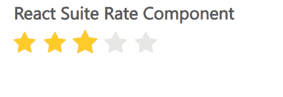

# 反应套件速率组件

> 原文:[https://www.geeksforgeeks.org/react-suite-rate-component/](https://www.geeksforgeeks.org/react-suite-rate-component/)

React Suite 是一个流行的前端库，包含一组为中间平台和后端产品设计的 React 组件。分级组件允许用户以分级的形式表示他对内容的兴趣。  我们可以在 ReactJS 中使用以下方法来使用 React 套件费率组件。

**等级道具:**

*   **allowalf:**表示是否支持半选。
*   **字符:**用于自定义字符。
*   **可清洗:**表示是否支持清除。
*   **默认值:**用于表示默认值。
*   **禁用:**用于禁用组件。
*   **max:** 用于表示最高分。
*   **渲染角色:**用于自定义渲染角色功能。
*   **readOnly:** 用于表示是否只读。
*   **尺寸:**用于设置组件尺寸。
*   **颜色:**用于表示按钮颜色。
*   **值:**用于表示值(受控)。
*   **垂直:**半选时用于方向。
*   **onChange:** 是值发生变化时触发的回调函数。
*   **onChangeActive:** 是悬停状态改变时触发的回调函数。

**创建反应应用程序并安装模块:**

*   **步骤 1:** 使用以下命令创建一个反应应用程序:

    ```
    npx create-react-app foldername
    ```

*   **步骤 2:** 在创建项目文件夹(即文件夹名**)后，使用以下命令将**移动到该文件夹:

    ```
    cd foldername
    ```

*   **步骤 3:** 创建 ReactJS 应用程序后，使用以下命令安装所需的****模块:****

    ```
    **npm install rsuite**
    ```

******项目结构:**如下图。****

****

项目结构**** 

******示例:**现在在 **App.js** 文件中写下以下代码。在这里，App 是我们编写代码的默认组件。****

## ****App.js****

```
**import React from 'react'
import 'rsuite/dist/styles/rsuite-default.css';
import { Rate } from 'rsuite';

export default function App() {

  return (
    <div style={{
      display: 'block', width: 600, paddingLeft: 30
    }}>
      <h4>React Suite Rate Component</h4>
      <Rate
        style={{ width: 300 }}
        defaultValue={1}
      />
    </div>
  );
}**
```

******运行应用程序的步骤:**从项目的根目录使用以下命令运行应用程序:****

```
**npm start**
```

******输出:**现在打开浏览器，转到***http://localhost:3000/***，会看到如下输出:****

********

******参考:**T2】https://rsuitejs.com/components/rate/****