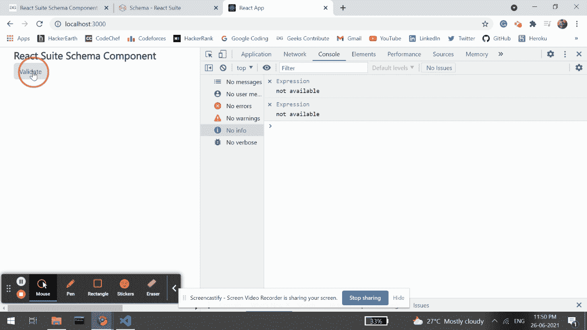

# 反应套件模式组件

> 原文:[https://www.geeksforgeeks.org/react-suite-schema-component/](https://www.geeksforgeeks.org/react-suite-schema-component/)

React Suite 是一个流行的前端库，包含一组为中间平台和后端产品设计的 React 组件。模式  组件允许用户定义用于验证数据的数据模型。我们可以在 ReactJS 中使用以下方法来使用 React Suite 模式组件。

**模式类型:**

*   **字符串类型:**用于验证字符串类型。
*   **数字类型:**用于验证数字类型。
*   **数组类型:**用于验证数组类型。
*   **日期类型:**用于验证日期类型。
*   **对象类型:**用于验证对象类型。
*   **布尔类型:**用于验证布尔类型。

**创建反应应用程序并安装模块:**

*   **步骤 1:** 使用以下命令创建一个反应应用程序:

    ```jsx
    npx create-react-app foldername
    ```

*   **步骤 2:** 在创建项目文件夹(即文件夹名**)后，使用以下命令将**移动到该文件夹:

    ```jsx
    cd foldername
    ```

*   **步骤 3:** 创建 ReactJS 应用程序后，使用以下命令安装所需的****模块:****

    ```jsx
    **npm install rsuite**
    ```

******项目结构:**如下图。****

****

项目结构**** 

******示例:**现在在 **App.js** 文件中写下以下代码。在这里，App 是我们编写代码的默认组件。****

## ****App.js****

```jsx
**import React from 'react'
import 'rsuite/dist/styles/rsuite-default.css';
import { Schema, Button } from 'rsuite';

// Extracting schema types
const { StringType, NumberType } = Schema.Types;

// Defining UserSchema modal
const userModel = Schema.Model({
    username: StringType().isRequired('Enter username!'),
    age: NumberType('Age should be a number')
        .range(0, 10, 'Enter between 0-10 year!')
});

// Checking userModel for sample user data
const userOne = userModel.check({ username: 'niharika', age: 50 });
const userTwo = userModel.check({ username: 'gourav', age: 10 });

export default function App() {
    return (
        <div style={{
            display: 'block', width: 700, paddingLeft: 30
        }}>
            <h4>React Suite Schema Component</h4>
            <Button onClick={() => {
                console.log("Validated User One: ", userOne)
                console.log("Validated User Two: ", userTwo)
            }}>Validate</Button>
        </div>
    );
}**
```

******运行应用程序的步骤:**从项目的根目录使用以下命令运行应用程序:****

```jsx
**npm start**
```

******输出:**现在打开浏览器，转到***http://localhost:3000/***，会看到如下输出:****

********

******参考:**T2】https://rsuitejs.com/components/schema/****