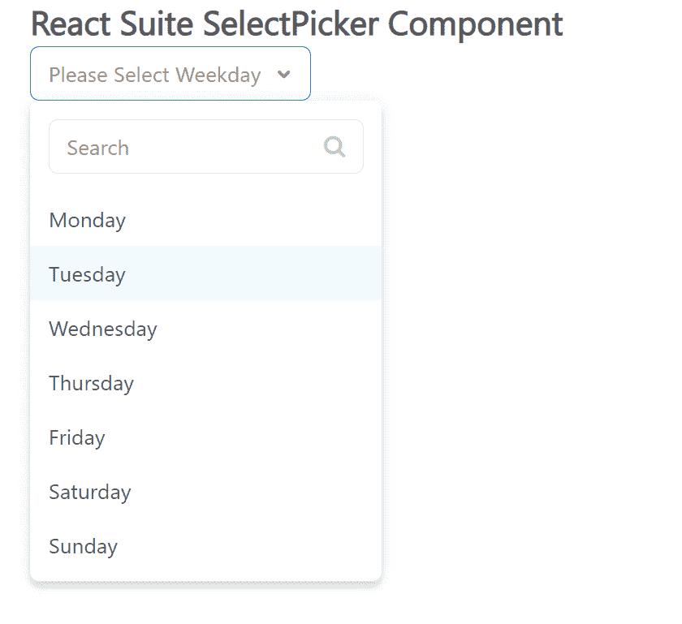

# 反应套件选择选择器组件

> 原文:[https://www . geesforgeks . org/react-suite-select picker-component/](https://www.geeksforgeeks.org/react-suite-selectpicker-component/)

React Suite 是一个流行的前端库，包含一组为中间平台和后端产品设计的 React 组件。选择选择器  组件允许用户选择单个段数据。该组件也支持分组。我们可以在 ReactJS 中使用以下方法来使用 React Suite SelectPicker 组件。

**选择者命题:**

*   **外观:**用于组件的外观。
*   **块:**用于块整行。
*   **类前缀:**用于表示组件 CSS 类的前缀。
*   **可清洗:**用于指示选项是否可以清空。
*   **容器:**用于设置渲染容器。
*   **可创建:**设置可以创建新选项。
*   **数据:**用于表示可选数据。
*   **默认值:**用于表示默认值。
*   **禁用:**表示组件是否禁用。
*   **disableItemValues:**用于禁用可选。
*   **分组依据:**用于设置“数据”中的分组条件“关键字”。
*   **标签页:**用于设置显示“数据”中“键”的选项。
*   **列表道具:**用于表示反应虚拟化中与列表相关的属性。
*   **最大高度:**用于设置下拉菜单的最大高度。
*   **菜单项名称:**用于表示应用于菜单 DOM 节点的 CSS 类。
*   **菜单样式:**用于表示应用于菜单 DOM 节点的样式。
*   **onChange:** 是一个回调函数，当值发生变化时触发。
*   **onClean:** 是值清空时触发的回调函数。
*   **onClose:** 是关闭事件触发的回调函数。
*   **onEnter:** 是一个回调函数，在叠加转换之前触发。
*   **OneHinded:**这是一个回调函数，在覆盖完成转换后触发。
*   **OnLining:**这是一个回调函数，当覆盖开始转换时被触发。
*   **onExit:** 它是一个回调函数，在覆盖转换之前被触发。
*   **onexitted:**是一个回调函数，在覆盖完成转换后触发。
*   **onExiting:** 是一个回调函数，在叠加开始向外过渡时触发。
*   **onGroupTitleClick:** 点击组头的回调函数。
*   **onOpen:** 是组件打开时触发的回调函数。
*   **onSearch:** 是搜索的回调函数。
*   **onSelect:** 是一个回调函数，在选择一个选项时触发。
*   **占位符:**用于表示占位符。
*   **放置:**用于元件的放置。
*   **preventOverflow:** 用于防止浮动元素溢出。
*   **渲染额外页脚:**用于自定义渲染额外页脚。
*   **渲染菜单:**用于自定义渲染菜单列表。
*   **渲染组:**用于自定义渲染选项组。
*   **渲染图元素:**用于自定义渲染选项。
*   **渲染值:**用于自定义渲染选定选项。
*   **搜索依据:**用于自定义搜索规则。
*   **可搜索:**用于表示是否可以搜索选项。
*   **尺寸:**用于表示采摘器尺寸。
*   **排序:**用于排序选项。
*   **toggleComponentClass:** 可用于该组件的自定义元素。
*   **值:**用于表示值(受控)。
*   **valueKey:** 用于设置“数据”中的选项值‘key’。
*   **虚拟化:**表示是否使用虚拟化列表。

**创建反应应用程序并安装模块:**

*   **步骤 1:** 使用以下命令创建一个反应应用程序:

    ```jsx
    npx create-react-app foldername
    ```

*   **步骤 2:** 创建项目文件夹(即文件夹名**)后，使用以下命令移动到该文件夹中:**

    ```jsx
    cd foldername
    ```

*   **步骤 3:** 创建 ReactJS 应用程序后，使用以下命令安装所需的****模块:****

    ```jsx
    **npm install rsuite**
    ```

******项目结构:**如下图。****

****

项目结构**** 

******示例:**现在在 **App.js** 文件中写下以下代码。在这里，App 是我们编写代码的默认组件。****

## ****App.js****

```jsx
**import React from 'react'
import 'rsuite/dist/styles/rsuite-default.css';
import { SelectPicker } from 'rsuite';

export default function App() {

  // Sample data 
  const options = [{
    "label": "Monday",
    "value": "Monday",
    "role": "Master",
  },
  {
    "label": "Tuesday",
    "value": "Tuesday",
    "role": "Master",
  },
  {
    "label": "Wednesday",
    "value": "Wednesday",
    "role": "Master",
  },
  {
    "label": "Thursday",
    "value": "Thursday",
    "role": "Master",
  },
  {
    "label": "Friday",
    "value": "Friday",
    "role": "Master",
  },
  {
    "label": "Saturday",
    "value": "Saturday",
    "role": "Master",
  },
  {
    "label": "Sunday",
    "value": "Sunday",
    "role": "Master",
  }]

  return (
    <div style={{
      display: 'block', width: 600, paddingLeft: 30
    }}>
      <h4>React Suite SelectPicker Component</h4>
      <SelectPicker placeholder="Please Select Weekday" data={options} />
    </div>
  );
}**
```

******运行应用程序的步骤:**从项目的根目录使用以下命令运行应用程序:****

```jsx
**npm start**
```

******输出:**现在打开浏览器，转到***http://localhost:3000/***，会看到如下输出:****

********

******参考:**T2】https://rsuitejs.com/components/select-picker/****