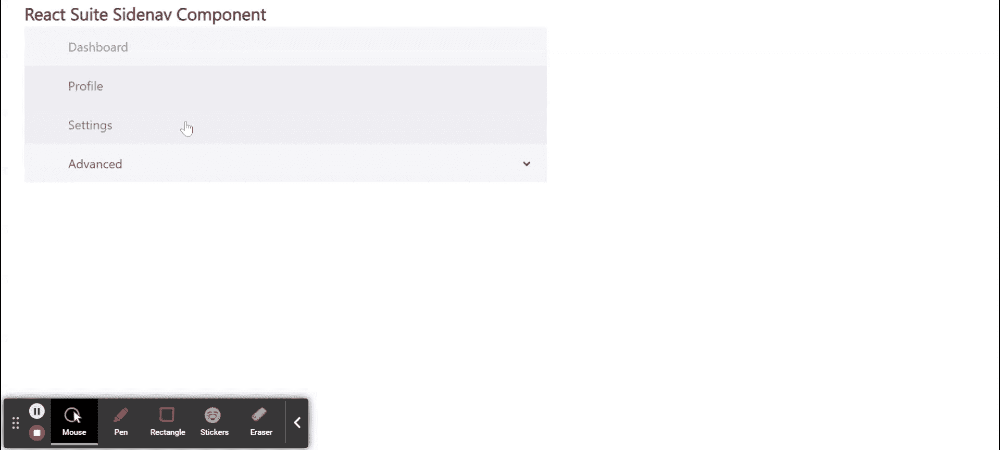

# 反应套件侧导航组件

> 原文:[https://www . geesforgeks . org/react-suite-side nav-component/](https://www.geeksforgeeks.org/react-suite-sidenav-component/)

React Suite 是一个流行的前端库，包含一组为中间平台和后端产品设计的 React 组件。侧导航  组件允许用户 p 提供一种简单的方法来浏览你的网站。被视为页面的 侧边栏。我们可以在 ReactJS 中使用以下方法来使用 React Suite 侧导航组件。

**船舶推进剂:**

*   **激活键:**用于表示*导航中*事件键*对应的激活键。第*项。
*   **外观:**用于菜单外观。
*   **类前缀:**用于表示组件 CSS 类的前缀。
*   **componentClass:** 可用于该组件的自定义元素类型。
*   **默认打开键:**用于表示对应于下拉菜单*事件键的打开菜单。*
*   **展开:**表示是否展开侧导航。
*   **on penchange:**用于表示菜单打开回调功能。
*   **onSelect:** 是一个回调函数，在菜单项的 Select 上触发。
*   **打开键:**用于表示与被控制的下拉*事件键*对应的打开菜单。

**创建反应应用程序并安装模块:**

*   **步骤 1:** 使用以下命令创建一个反应应用程序:

    ```jsx
    npx create-react-app foldername
    ```

*   **步骤 2:** 创建项目文件夹(即文件夹名**)后，使用以下命令移动到该文件夹中:**

    ```jsx
    cd foldername
    ```

*   **步骤 3:** 创建 ReactJS 应用程序后，使用以下命令安装所需的****模块:****

    ```jsx
    **npm install rsuite**
    ```

******项目结构:**如下图。****

****

项目结构**** 

******示例:**现在在 **App.js** 文件中写下以下代码。在这里，App 是我们编写代码的默认组件。****

## ****App.js****

```jsx
**import React from 'react'
import 'rsuite/dist/styles/rsuite-default.css';
import { Sidenav, Nav, Dropdown } from 'rsuite';

export default function App() {

  return (
    <div style={{
      display: 'block', width: 700, paddingLeft: 30
    }}>
      <h4>React Suite Sidenav Component</h4>
      <Sidenav defaultOpenKeys={['3', '4']} activeKey="1">
        <Sidenav.Body>
          <Nav>
            <Nav.Item eventKey="1">Dashboard</Nav.Item>
            <Nav.Item eventKey="2">Profile</Nav.Item>
            <Nav.Item eventKey="3">Settings</Nav.Item>
            <Dropdown eventKey="4" title="Advanced">
              <Dropdown.Item eventKey="4-1">Privacy</Dropdown.Item>
              <Dropdown.Item eventKey="4-2">About</Dropdown.Item>
              <Dropdown.Item eventKey="4-3">Terms</Dropdown.Item>
            </Dropdown>
          </Nav>
        </Sidenav.Body>
      </Sidenav>
    </div>
  );
}**
```

******运行应用程序的步骤:**从项目的根目录使用以下命令运行应用程序:****

```jsx
**npm start**
```

******输出:**现在打开浏览器，转到***http://localhost:3000/***，会看到如下输出:****

********

******参考:**T2】https://rsuitejs.com/components/sidenav/****