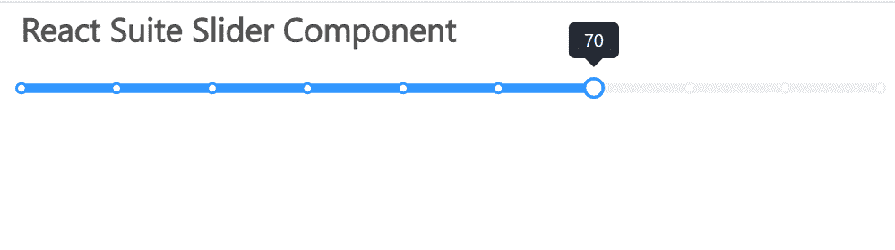

# 反应套件滑块组件

> 原文:[https://www.geeksforgeeks.org/react-suite-slider-component/](https://www.geeksforgeeks.org/react-suite-slider-component/)

React Suite 是一个流行的前端库，包含一组为中间平台和后端产品设计的 React 组件。滑块  组件允许用户从滑块获取输入，然后显示电流值。我们可以在 ReactJS 中使用以下方法来使用 React Suite 滑块组件。

**滑块道具:**

*   **barClassName:** 用于表示应用于 Bar DOM 节点的 CSS 类。
*   **默认值:**用于表示默认值。
*   **禁用:**用于禁用组件。
*   **刻度:**用于显示蜱。
*   **handleClassName:** 用于表示应用于 Handle 节点的 CSS 类。
*   **手柄样式:**用于表示应用于手柄节点的 CSS 样式。
*   **手柄标题:**用于自定义手柄内部显示的内容。
*   **max:** 用于表示滑动范围的最大值。
*   **min:** 用于表示滑动范围的最小值。
*   **onChange:** 是一个改变数据的回调函数。
*   **进度:**用于显示滑动进度条。
*   **渲染标记:**用于自定义渲染标尺上的标签。
*   **步:**用于滑动一步的数值。
*   **工具提示:**用于指示滑动时是否显示工具提示。
*   **值:**用于表示值(受控)。
*   **垂直:**用于垂直滑动。

**RangeSlider Props:**

*   **barClassName:** 用于表示应用于 Bar DOM 节点的 CSS 类。
*   **默认值:**用于表示默认值。
*   **禁用:**用于禁用组件。
*   **刻度:**用于显示蜱。
*   **handleClassName:** 用于表示应用于 Handle 节点的 CSS 类。
*   **手柄样式:**用于表示应用于手柄节点的 CSS 样式。
*   **手柄标题:**用于自定义手柄内部显示的内容。
*   **max:** 用于表示滑动范围的最大值。
*   **min:** 用于表示滑动范围的最小值。
*   **onChange:** 是一个改变数据的回调函数。
*   **进度:**用于显示滑动进度条。
*   **渲染标记:**用于自定义渲染标尺上的标签。
*   **步:**用于滑动一步的数值。
*   **工具提示:**用于指示滑动时是否显示工具提示。
*   **值:**用于表示值(受控)。
*   **垂直:**用于垂直滑动。

**创建反应应用程序并安装模块:**

*   **步骤 1:** 使用以下命令创建一个反应应用程序:

    ```
    npx create-react-app foldername
    ```

*   **步骤 2:** 在创建项目文件夹(即文件夹名**)后，使用以下命令将**移动到该文件夹:

    ```
    cd foldername
    ```

*   **步骤 3:** 创建 ReactJS 应用程序后，使用以下命令安装所需的****模块:****

    ```
    **npm install rsuite**
    ```

******项目结构:**如下图。****

****

项目结构**** 

******示例:**现在在 **App.js** 文件中写下以下代码。在这里，App 是我们编写代码的默认组件。****

## ****App.js****

```
**import React from 'react'
import 'rsuite/dist/styles/rsuite-default.css';
import { Slider } from 'rsuite';

export default function App() {

  return (
    <div style={{
      display: 'block', width: 600, paddingLeft: 30
    }}>
      <h4>React Suite Slider Component</h4> <br></br>
      <Slider
        max={100}
        min={10}
        step={10}
        defaultValue={50}
        graduated
        progress
      />
    </div>
  );
}**
```

******运行应用程序的步骤:**从项目的根目录使用以下命令运行应用程序:****

```
**npm start**
```

******输出:**现在打开浏览器，转到***http://localhost:3000/***，会看到如下输出:****

********

******参考:**T2】https://rsuitejs.com/components/slider/****