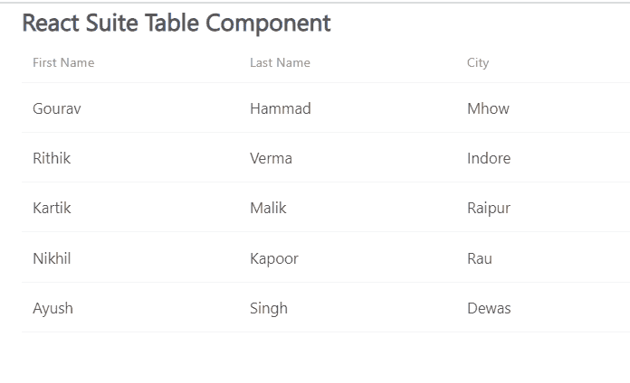

# 反应套件表组件

> 原文:[https://www.geeksforgeeks.org/react-suite-table-component/](https://www.geeksforgeeks.org/react-suite-table-component/)

React Suite 是一个流行的前端库，包含一组为中间平台和后端产品设计的 React 组件。表  组件允许用户显示行数据。我们可以使用这个组件创建表。我们可以在 ReactJS 中使用以下方法来使用 React Suite 表组件。

**桌面道具:**

*   **粘贴表头:**用于将表头粘贴到页面指定位置。
*   **粘贴水平滚动条:**用于将表格水平滚动条粘贴到页面的指定位置。
*   **自动高度:**用于自动高度。
*   **bodyRef:** 用于表示附加到表体元素的 Ref。
*   **加边框:**用于显示边框。
*   **单元格边框:**用于显示单元格边框。
*   **数据:**用于表示表格数据。
*   **defaultExpandAllRows:** 默认用于展开所有节点。
*   **DefaultExpandRowKeys:**用于通过 rowkey 指定默认的展开行。
*   **默认排序类型:**用于表示排序类型。
*   **扩展行键:**用于通过行键指定默认的扩展行。
*   **表头高度:**用于表示表头高度。
*   **高度:**用于表示工作台高度。
*   **悬停:**用于表示表格的行有鼠标悬停效果。
*   **isTree:** 用于显示为树形表。
*   **装载:**用于显示装载。
*   **明八:**用于表示最小高度。
*   **onDataUpdated:** 是表数据更新后触发的回调函数。
*   **onExpandChange:** 是扩展时在扩展节点触发的回调函数。
*   **onRowClick:** 是行后触发的回调函数，返回 rowDate。
*   **onScroll:** 是滚动条滚动触发的回调函数。
*   **onSortColumn:** 排序序列的回调函数返回 SortColumn，sortType 的值。
*   **renderEmpty:** 用于自定义空显示内容中的数据。
*   **渲染加载:**用于自定义数据加载中的显示内容。
*   **renderRowExpanded:** 用于自定义扩展区域的方式。
*   **rendertreettoggle:**是切换时在扩展节点触发的回调函数。
*   **rowClassName:** 用于向行中添加可选的额外类名。
*   **rowExpandedHeight:** 用于设置可扩展区域的高度。
*   **行高:**用来表示行高。
*   **rowKey:** 用来表示行键。
*   **shouldUpdateScroll:** 表示数据更新后是否更新滚动条。
*   **显示表头:**用于显示表头。
*   **排序列:**用于排序列名。
*   **排序类型:**用于表示排序类型(受控)。
*   **虚拟化:**用于有效渲染大型表格数据。
*   **宽度:**用于表示表格宽度。
*   **wordWrap:** 用于使单元格自动换行。

**表。立柱道具**

*   **对齐:**用于对齐。
*   **当合并列的数据键值为空或未定义时，要合并的列单元格。**
*   **固定:**用于固定柱。
*   **flexGrow:** 设置列宽在设置 flexGrow 无法设置大小和宽度属性时自动调整
*   **最小宽度:**用于使用 flexGrow 时，通过最小宽度设置最小宽度。
*   **onResize:** 是列宽变化后触发的回调函数。
*   **可调整大小:**用于可自定义的调整列宽。
*   **可排序:**表示是否可排序。
*   **treeCol:** 用来表示树的一列。
*   **垂直对齐:**用于垂直对齐。
*   **宽度:**用于表示列宽。

**表。柱组道具:**

*   **对齐:**用于对齐。
*   **固定:**用于固定柱组。
*   **垂直对齐:**用于垂直对齐。
*   **表头:**用于集团表头。

**表。细胞道具:**

*   **数据键:**用于表示数据绑定键。
*   **行数据:**用于表示行数据。
*   **行索引:**用于表示行号。

**表。页码 Props:**

*   **活动页面:**用于配置当前页码。
*   **禁用:**用于禁用组件。
*   **显示长度:**配置每页显示多少行条目，对应长度菜单
*   **首先:**用于显示首页按钮。
*   **最后:**用于显示最后一页按钮。
*   **长度菜单:**用于表示分页显示行号配置。
*   **最大按钮:**用于配置显示按钮的最大数量。
*   **下一步:**用于显示下一页按钮。
*   **onChangeLength:** 是一个回调函数，当 lengthMenu 值改变时触发。
*   **onChangePage:** 是页面发生变化时触发的回调函数。
*   **上一页:**用于显示上一页按钮。
*   **渲染长度菜单:**用于自定义菜单。
*   **渲染总计:**用于自定义总计。
*   **反转:**用于反转起始位置和结束位置。
*   **显示信息:**用于显示寻呼信息。
*   **显示长度菜单:**用于显示下拉菜单。
*   **总计:**用于表示数据条目的总数。

**创建反应应用程序并安装模块:**

*   **步骤 1:** 使用以下命令创建一个反应应用程序:

    ```jsx
    npx create-react-app foldername
    ```

*   **步骤 2:** 在创建项目文件夹(即文件夹名**)后，使用以下命令将**移动到该文件夹:

    ```jsx
    cd foldername
    ```

*   **步骤 3:** 创建 ReactJS 应用程序后，使用以下命令安装所需的****模块:****

    ```jsx
    **npm install rsuite**
    ```

******项目结构:**如下图。****

****

项目结构**** 

******示例:**现在在 **App.js** 文件中写下以下代码。在这里，App 是我们编写代码的默认组件。****

## ****App.js****

```jsx
**import React from 'react'
import 'rsuite/dist/styles/rsuite-default.css';
import { Table } from 'rsuite';
const { Column, HeaderCell, Cell } = Table;

export default function App() {

    // Sample table data
    const sampleData = [
        { firstName: 'Gourav', lastName: 'Hammad', city: 'Mhow' },
        { firstName: 'Rithik', lastName: 'Verma', city: 'Indore' },
        { firstName: 'Kartik', lastName: 'Malik', city: 'Raipur' },
        { firstName: 'Nikhil', lastName: 'Kapoor', city: 'Rau' },
        { firstName: 'Ayush', lastName: 'Singh', city: 'Dewas' }
    ]

    return (
        <div style={{
            display: 'block', width: 700, paddingLeft: 30
        }}>
            <h4>React Suite Table Component</h4>
            <Table
                height={500}
                data={sampleData}
            >
                <Column width={200}>
                    <HeaderCell>First Name</HeaderCell>
                    <Cell dataKey="firstName" />
                </Column>
                <Column width={200}>
                    <HeaderCell>Last Name</HeaderCell>
                    <Cell dataKey="lastName" />
                </Column>
                <Column width={200}>
                    <HeaderCell>City</HeaderCell>
                    <Cell dataKey="city" />
                </Column>
            </Table>
        </div>
    );
}**
```

******运行应用程序的步骤:**从项目的根目录使用以下命令运行应用程序:****

```jsx
**npm start**
```

******输出:**现在打开浏览器，转到***http://localhost:3000/***，会看到如下输出:****

********

******参考:**T2】https://rsuitejs.com/components/table/****