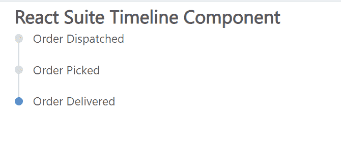

# 反应套件时间线组件

> 原文:[https://www . geesforgeks . org/react-suite-timeline-component/](https://www.geeksforgeeks.org/react-suite-timeline-component/)

React Suite 是一个流行的前端库，包含一组为中间平台和后端产品设计的 React 组件。时间线  组件允许用户 p 提供垂直显示时间线。  我们可以在 ReactJS 中使用以下方法来使用 React Suite 时间轴组件。

**时间线道具:**

*   **对齐:**用于时间轴内容对齐。
*   **儿童:**用于表示成分的含量。
*   **类前缀:**用于表示组件 CSS 类的前缀。
*   **componentClass:** 可用于该组件的自定义元素类型。
*   **无尽:**用于时间轴无尽。

**时间线。物品道具:**

*   **儿童:**用于表示成分的含量。
*   **类前缀:**用于表示组件 CSS 类的前缀。
*   **componentClass:** 可用于该组件的自定义元素类型。
*   **无尽:**用于时间轴无尽。
*   **点:**用于自定义时间轴项目。
*   **时间:**用于自定义时间轴时间。

**创建反应应用程序并安装模块:**

*   **步骤 1:** 使用以下命令创建一个反应应用程序:

    ```jsx
    npx create-react-app foldername
    ```

*   **步骤 2:** 创建项目文件夹(即文件夹名**)后，使用以下命令移动到该文件夹中:**

    ```jsx
    cd foldername
    ```

*   **步骤 3:** 创建 ReactJS 应用程序后，使用以下命令安装所需的****模块:****

    ```jsx
    **npm install rsuite**
    ```

******项目结构:**如下图。****

****

项目结构**** 

******示例:**现在在 **App.js** 文件中写下以下代码。在这里，App 是我们编写代码的默认组件。****

## ****App.js****

```jsx
**import React from 'react'
import 'rsuite/dist/styles/rsuite-default.css';
import { Timeline } from 'rsuite';

export default function App() {

  return (
    <div style={{
      display: 'block', width: 700, paddingLeft: 30
    }}>
      <h4>React Suite Timeline Component</h4>
      <Timeline>
        <Timeline.Item>Order Dispatched</Timeline.Item>
        <Timeline.Item>Order Picked</Timeline.Item>
        <Timeline.Item>Order Delivered</Timeline.Item>
      </Timeline>
    </div>
  );
}**
```

******运行应用程序的步骤:**从项目的根目录使用以下命令运行应用程序:****

```jsx
**npm start**
```

******输出:**现在打开浏览器，转到***http://localhost:3000/***，会看到如下输出:****

********

******参考:**T2】https://rsuitejs.com/components/timeline/****