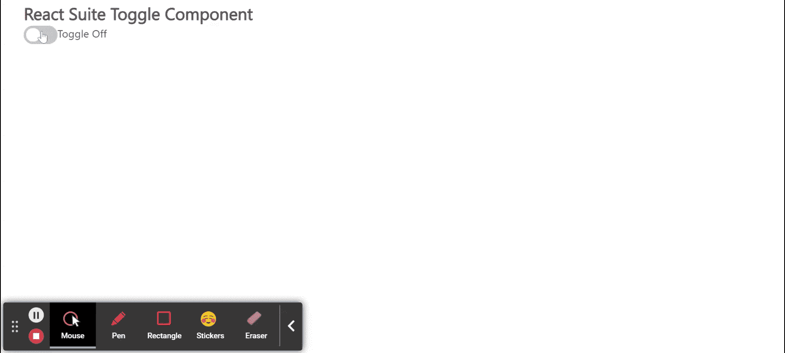

# 反应套件切换组件

> 原文:[https://www.geeksforgeeks.org/react-suite-toggle-component/](https://www.geeksforgeeks.org/react-suite-toggle-component/)

React Suite 是一个流行的前端库，包含一组为中间平台和后端产品设计的 React 组件。切换  组件允许用户在两个值之间选择 。 我们可以在 ReactJS 中使用以下方法来使用 React Suite 切换组件。

**切换道具:**

<figure class="table">

| **Check** | Used to check the status (controlled). |
| **被检查儿童:** | Used to check the displayed content. |
| **Class prefix** | Prefix used to represent component CSS class. |
| is checked by default. | Used to indicate the default check. |
| **Disabled:** | It is used to disable components. |
| **onChange** | It is a callback function that is triggered when the state changes. |
| **dimension** | It is used to indicate the size of the elbow joint. |
| **Uncheck** | Used to uncheck the display content. |

</figure>

**创建反应应用程序并安装模块:**

*   **步骤 1:** 使用以下命令创建一个反应应用程序:

    ```
    npx create-react-app foldername
    ```

*   **步骤 2:** 创建项目文件夹后，即文件夹名称**，**使用以下命令移动到项目文件夹:

    ```
    cd foldername
    ```

*   **步骤 3:** 创建 ReactJS 应用程序后，使用以下命令安装所需的****模块:****

    ```
    **npm install rsuite**
    ```

******项目结构:**如下图。****

****

项目结构**** 

******示例:**现在在 **App.js** 文件中写下以下代码。在这里，App 是我们编写代码的默认组件。****

## ****App.js****

```
**// Importing required libraries
import React from 'react'
import 'rsuite/dist/styles/rsuite-default.css';
import { Toggle } from 'rsuite';

export default function App() {

  // State for the current toggle value
  const [currentValue, setCurrentValue] = React.useState(0)

  return (
    <div style={{
      display: 'block', width: 400, paddingLeft: 30
    }}>
      <h4>React Suite Toggle Component</h4>
      <Toggle
        onChange={(value) => { setCurrentValue(value) }}
      />
      {currentValue === true ? "Toggle On" : "Toggle Off"}
    </div>
  );
}**
```

******运行应用程序的步骤:**从项目的根目录使用以下命令运行应用程序:****

```
**npm start**
```

******输出:******

****现在打开浏览器，转到***http://localhost:3000/***，会看到如下输出:****

********

******参考:**T2】https://rsuitejs.com/components/toggle/****