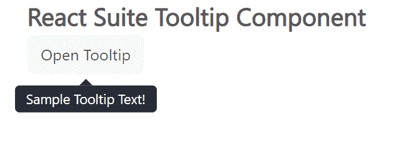

# 反应套件工具提示组件

> 原文:[https://www . geesforgeks . org/react-suite-tooltip-component/](https://www.geeksforgeeks.org/react-suite-tooltip-component/)

React Suite 是一个流行的前端库，包含一组为中间平台和后端产品设计的 React 组件。工具提示  组件允许用户在悬停、聚焦或点击元素时显示信息性文本。我们可以在 ReactJS 中使用以下方法来使用 React 套件工具提示组件。

**工具提示道具：**

*   **儿童:**表示主要内容。
*   **类前缀:**用于表示组件 CSS 类的前缀。
*   **可见:**用于表示组件是否可见。

**耳语道具:**

*   **容器:**用于设置渲染容器。
*   **延迟:**用于表示延迟时间。
*   **延迟时间:**用于表示隐藏的延迟时间。
*   **延时显示:**用于显示延时时间。
*   **on bull:**是失焦时触发的功能。
*   **onClick:** 是点击事件触发的功能。
*   **onEnter:** 是在叠加转换之前触发的功能。
*   **输入:**是叠加完成转换后触发的功能。
*   **集中:**这是一个在叠加开始过渡时触发的功能。
*   **onExit:** 这是一个在叠加转换之前触发的功能。
*   **onexitted:**是叠加完成过渡后触发的功能。
*   **onexitting:**是叠加开始向外过渡时触发的功能。
*   **onFocus:** 是触发获得焦点的功能。
*   **onMouseOut:** 是鼠标离开事件触发的功能。
*   **放置:**用于组件的放置。
*   **preventOverflow:** 用于防止浮动元素溢出。
*   **扬声器:**用于显示的组件。
*   **触发:**用于触发事件。

**耳语方法:**

*   **打开:**此方法用于显示工具提示。
*   **关闭:**此方法用于关闭工具提示。

**创建反应应用程序并安装模块:**

*   **步骤 1:** 使用以下命令创建一个反应应用程序:

    ```jsx
    npx create-react-app foldername
    ```

*   **步骤 2:** 创建项目文件夹(即文件夹名**)后，使用以下命令移动到该文件夹中:**

    ```jsx
    cd foldername
    ```

*   **步骤 3:** 创建 ReactJS 应用程序后，使用以下命令安装所需的****模块:****

    ```jsx
    **npm install rsuite**
    ```

******项目结构:**如下图。****

****

项目结构**** 

******示例:**现在在 **App.js** 文件中写下以下代码。在这里，App 是我们编写代码的默认组件。****

## ****App.js****

```jsx
**import React from 'react'
import 'rsuite/dist/styles/rsuite-default.css';
import { Button, Tooltip, Whisper } from 'rsuite'

export default function App() {
  return (
    <div style={{
      display: 'block', width: 700, paddingLeft: 30
    }}>
      <h4>React Suite Tooltip Component</h4>
      <Whisper
        trigger="click"
        placement="bottom"
        speaker={<Tooltip>Sample Tooltip Text!</Tooltip>}
      >
        <Button appearance="subtle">Open Tooltip</Button>
      </Whisper>
    </div>
  );
}**
```

******运行应用程序的步骤:**从项目的根目录使用以下命令运行应用程序:****

```jsx
**npm start**
```

******输出:**现在打开浏览器，转到***http://localhost:3000/***，会看到如下输出:****

********

******参考:**T2】https://rsuitejs.com/components/tooltip/****