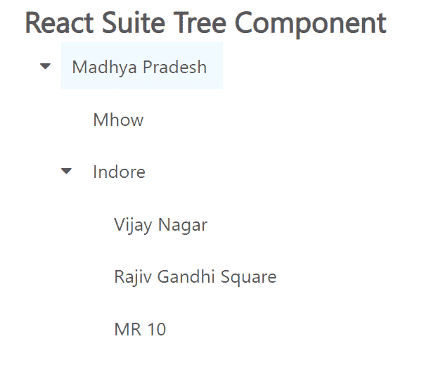

# 反应套件树组件

> 原文:[https://www.geeksforgeeks.org/react-suite-tree-component/](https://www.geeksforgeeks.org/react-suite-tree-component/)

React Suite 是一个流行的前端库，包含一组为中间平台和后端产品设计的 React 组件。树组件允许用户显示树结构的数据。  我们可以在 ReactJS 中使用以下方法来使用 React Suite 树组件。

**树木道具:**

*   **childrenKey:** 用于表示 Tree 数据结构 Children 属性名称。
*   **类前缀:**用于表示组件 CSS 类的前缀。
*   **数据:**用于表示可选数据。
*   **defaultexpandal:**默认用于扩展所有节点。
*   **defaultExpandItemValues:** 用于设置默认扩展节点的值。
*   **默认值:**用于表示默认值。
*   **disableItemValues:**用于禁用可选。
*   **可拖动:** 用于设置拖动节点。
*   **expandItemValues:** 用于设置扩展节点(受控)的值。
*   **高度:**用于表示菜单高度。
*   **标签页:**用于设置显示“数据”中“键”的选项。
*   **onChange:** 是一个回调函数，当值发生变化时触发。
*   **onDragStart:** 是节点拖动开始时触发的回调函数。
*   **onDragEnter:** 是节点拖拽进入时触发的回调函数。
*   **onDragOver:** 是节点拖动过来时触发的回调函数。
*   **onDragLeave:** 是节点拖拽离开时触发的回调函数。
*   **onDragEnd:** 是节点拖动结束时触发的回调函数。
*   **onDrop:** 是节点掉落时触发的回调函数。
*   **onExpand:** 是显示树节点时触发的回调函数。
*   **onSelect:** 是一个回调函数，在选择一个选项时触发。
*   **渲染拖动节点:**当可拖动为真时，用于自定义渲染拖动节点。
*   **渲染树图标:**用于表示自定义渲染图标。
*   **渲染树节点:**用于表示自定义渲染树节点。
*   **searchKeyword:** 用于表示搜索关键字(受控)。
*   **值:**用于表示值(受控)。
*   **valueKey:** 用于设置“数据”中的选项值‘key’。
*   **虚拟化:**表示是否使用虚拟化列表。

**创建反应应用程序并安装模块:**

*   **步骤 1:** 使用以下命令创建一个反应应用程序:

    ```
    npx create-react-app foldername
    ```

*   **步骤 2:** 创建项目文件夹(即文件夹名**)后，使用以下命令移动到该文件夹中:**

    ```
    cd foldername
    ```

*   **步骤 3:** 创建 ReactJS 应用程序后，使用以下命令安装所需的****模块:****

    ```
    **npm install rsuite**
    ```

******项目结构:**如下图。****

****

项目结构**** 

******示例:**现在在 **App.js** 文件中写下以下代码。在这里，App 是我们编写代码的默认组件。****

## ****App.js****

```
**import React from 'react'
import 'rsuite/dist/styles/rsuite-default.css';
import { Tree } from 'rsuite';

export default function App() {

  // Sample Options
  const options = [
    {
      "label": "Madhya Pradesh",
      "value": 1,
      "children": [
        {
          "label": "Mhow",
          "value": 2
        },
        {
          "label": "Indore",
          "value": 3,
          "children": [
            {
              "label": "Vijay Nagar",
              "value": 4
            },
            {
              "label": "Rajiv Gandhi Square",
              "value": 5
            },
            {
              "label": "MR 10",
              "value": 6
            },
          ]
        },
      ]
    }
  ]

  return (
    <div style={{
      display: 'block', width: 600, paddingLeft: 30
    }}>
      <h4>React Suite Tree Component</h4>
      <Tree
        style={{ width: 300 }}
        defaultExpandAll
        data={options}
      />
    </div>
  );
}**
```

******运行应用程序的步骤:**从项目的根目录使用以下命令运行应用程序:****

```
**npm start**
```

******输出:**现在打开浏览器，转到***http://localhost:3000/***，会看到如下输出:****

********

******参考:**T2】https://rsuitejs.com/components/tree/****