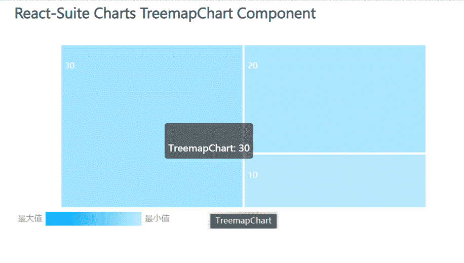

# 反应套件树形图组件

> 原文:[https://www . geesforgeks . org/react-suite-tree mapchart-component/](https://www.geeksforgeeks.org/react-suite-treemapchart-component/)

React Suite Charts 是一个流行的前端库，包含一组 React 组件，用于提供一组基于 rsuite 和 echarts 的图表。树形图  组件允许用户以矩形树形图的形式提供数据。  我们可以在 ReactJS 中使用下面的方法来使用 React Suite 树形图组件。

**tree map hart props:**

*   **名称:**用于表示图形的名称。
*   **数据:**用于传递图形的数据。
*   **高度:**用于表示图形高度。

**创建反应应用程序并安装模块:**

*   **步骤 1:** 使用以下命令创建一个反应应用程序:

    ```
    npx create-react-app foldername
    ```

*   **步骤 2:** 创建项目文件夹(即文件夹名**)后，使用以下命令移动到该文件夹中:**

    ```
    cd foldername
    ```

*   **步骤 3:** 创建 ReactJS 应用程序后，使用以下命令安装所需的****模块:****

    ```
    **npm install @rsuite/charts**
    ```

******项目结构:**如下图。****

****

项目结构**** 

******示例:**现在在 **App.js** 文件中写下以下代码。在这里，App 是我们编写代码的默认组件。****

## ****App.js****

```
**import React from 'react'
import 'rsuite/dist/styles/rsuite-default.css';
import { TreemapChart } from '@rsuite/charts';

export default function App() {

  // Sample data
  const sampleData = [10, 20, 30];

  return (
    <div style={{
      display: 'block', width: 700, paddingLeft: 30
    }}>
      <h4>React-Suite Charts TreemapChart Component</h4>
      <TreemapChart height={300} name="TreemapChart" data={sampleData} />
    </div >
  );
}**
```

******运行应用程序的步骤:**从项目的根目录使用以下命令运行应用程序:****

```
**npm start**
```

******输出:**现在打开浏览器，转到***http://localhost:3000/***，会看到如下输出:****

********

******参考:**[https://charts . rsejos . com/# %和 7% 9f %至 9%和 5% BD %至 2%和 6%至 0% 91%和 5% 9b %为](https://charts.rsuitejs.com/#%E7%9F%A9%E5%BD%A2%E6%A0%91%E5%9B%BE)****