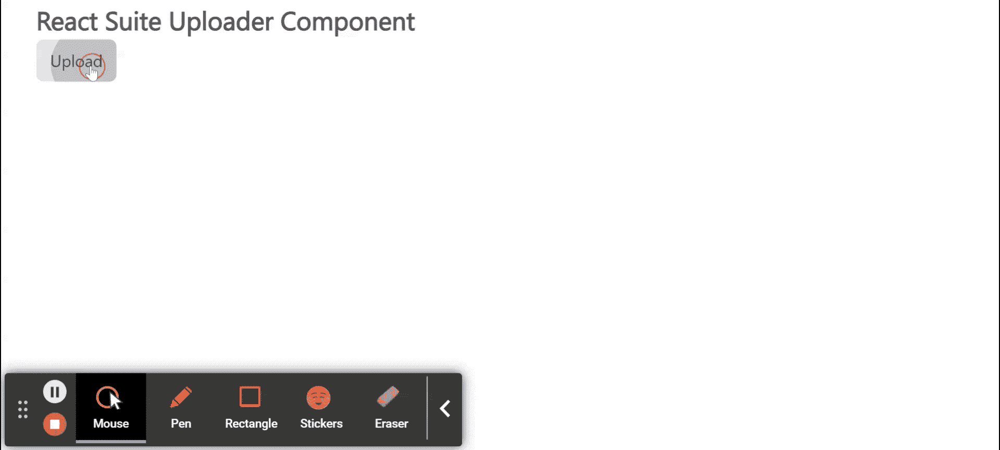

# 反应套件上传器组件

> 原文:[https://www . geesforgeks . org/react-suite-uploader-component/](https://www.geeksforgeeks.org/react-suite-uploader-component/)

React Suite 是一个流行的前端库，包含一组为中间平台和后端产品设计的 React 组件。上传器  组件允许用户从系统上传文件。我们可以在 ReactJS 中使用以下方法来使用 React Suite 上传器组件。

**上传者 Props:**

*   **接受:**表示可以接受的文件类型。
*   **动作:**用于表示上传网址。
*   **自动上传:**用于表示选择文件后的自动上传。
*   **类前缀:**用于表示组件 CSS 类的前缀。
*   **数据:**用于表示参数的上传。
*   **defaultFileList:** 用于表示上传文件的列表。
*   **禁用:**表示禁用上传按钮。
*   **禁用文件项:**用于禁用文件列表。
*   **可拖拽:**用于启用拖拽上传。
*   **文件列表:**用于表示上传文件的列表。
*   **文件列表可见:**用于表示文件列表可见。
*   **表头:**用于设置上传请求表头。
*   **列表类型:**用于表示上传列表样式。
*   **maxpreviewpilesize:**用于设置预览文件的最大限制。
*   **multiple:** 用于允许一次选择多个文件上传。
*   **名称:**用于上传对应文件的参数名称。
*   **onChange:** 是上传队列发生变化的回调函数。
*   **onError:** 是上传出错时触发的回调函数。
*   **onPreview:** 是上传文件预览时触发的回调函数。
*   **onProgress:** 是上传进度变化的回调函数。
*   **onRemove:** 是删除文件的回调函数。
*   **onreload:**是一个回调函数，用于重新上传文件。
*   **onSuccess:** 是上传成功后的回调函数。
*   **onUpload:** 是启动上传文件的回调函数。
*   **渲染文件信息:**用于自定义渲染文件信息。
*   **可移动:**用于启用可移动列表文件。
*   **shouldQueueUpdate:** 用于允许更新队列。
*   **shouldUpload:** 用于允许上传文件。
*   **超时:**用于设置上传超时。
*   **toggleComponentClass:** 可用于该组件的自定义元素。
*   **withCredentials:** 用于表示上传请求时是否携带 cookies。

**创建反应应用程序并安装模块:**

*   **步骤 1:** 使用以下命令创建一个反应应用程序:

    ```
    npx create-react-app foldername
    ```

*   **步骤 2:** 创建项目文件夹(即文件夹名**)后，使用以下命令移动到该文件夹中:**

    ```
    cd foldername
    ```

*   **步骤 3:** 创建 ReactJS 应用程序后，使用以下命令安装所需的****模块:****

    ```
    **npm install rsuite**
    ```

******项目结构:**如下图。****

****

项目结构**** 

******示例:**现在在 **App.js** 文件中写下以下代码。在这里，App 是我们编写代码的默认组件。****

## ****App.js****

```
**import React from 'react'
import 'rsuite/dist/styles/rsuite-default.css';
import { Uploader } from 'rsuite';

export default function App() {

  return (
    <div style={{
      display: 'block', width: 600, paddingLeft: 30
    }}>
      <h4>React Suite Uploader Component</h4>
      <Uploader action="//jsonplaceholder.typicode.com/posts/" />
    </div>
  );
}**
```

******运行应用程序的步骤:**从项目的根目录使用以下命令运行应用程序:****

```
**npm start**
```

******输出:**现在打开浏览器，转到***http://localhost:3000/***，会看到如下输出:****

********

******参考:**T2】https://rsuitejs.com/components/uploader/****