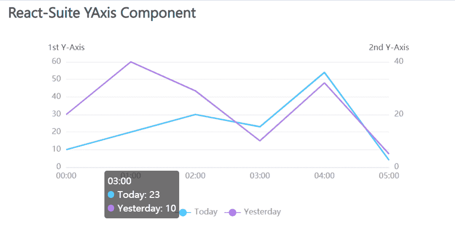

# 反应套件雅西组件

> 原文:[https://www.geeksforgeeks.org/react-suite-yaxis-component/](https://www.geeksforgeeks.org/react-suite-yaxis-component/)

React Suite Charts 是一个流行的前端库，包含一组 React 组件，用于提供一组基于 rsuite 和 echarts 的图表。雅西组件有助于在图表中添加 Y 轴。我们可以在 ReactJS 中使用以下方法来使用 React Suite YAxis 组件。

**亚西斯命题:**

*   **名称:**用于表示部件的名称。
*   **最小间隔值:**用于表示最小间隔。

**创建反应应用程序并安装模块:**

*   **步骤 1:** 使用以下命令创建一个反应应用程序:

    ```jsx
    npx create-react-app foldername
    ```

*   **步骤 2:** 创建项目文件夹(即文件夹名**)后，使用以下命令移动到该文件夹中:**

    ```jsx
    cd foldername
    ```

*   **步骤 3:** 创建 ReactJS 应用程序后，使用以下命令安装所需的****模块:****

    ```jsx
    **npm install @rsuite/charts**
    ```

******项目结构:**如下图。****

****

项目结构**** 

******示例:**现在在 **App.js** 文件中写下以下代码。在这里，App 是我们编写代码的默认组件。****

## ****App.js****

```jsx
**import React from 'react'
import 'rsuite/dist/styles/rsuite-default.css';
import { LineChart, Line, YAxis } from '@rsuite/charts';

export default function App() {

  // Sample Data
  const sampleData = [
    ['00:00', 10, 20],
    ['01:00', 20, 40],
    ['02:00', 30, 29],
    ['03:00', 23, 10],
    ['04:00', 54, 32],
    ['05:00', 4, 5],
  ];

  return (
    <div style={{
      display: 'block', width: 700, paddingLeft: 30
    }}>
      <h4>React-Suite YAxis Component</h4>
      <LineChart name="Multiple Lines" data={sampleData}>
        <YAxis name="1st Y-Axis" minInterval={10} />
        <YAxis name="2nd Y-Axis" minInterval={20} />
        <Line name="Today" yAxisIndex={0} />
        <Line name="Yesterday" yAxisIndex={1} />
      </LineChart>
    </div>
  );
}**
```

******运行应用程序的步骤:**从项目的根目录使用以下命令运行应用程序:****

```jsx
**npm start**
```

******输出:**现在打开浏览器，转到***http://localhost:3000/***，会看到如下输出:****

********

******参考:**T2】https://charts.rsuitejs.com/****