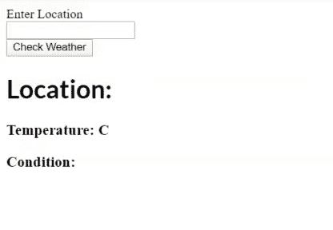

# ReactJS | AJAX 和 API

> 原文:[https://www.geeksforgeeks.org/reactjs-ajax-and-api/](https://www.geeksforgeeks.org/reactjs-ajax-and-api/)

API 用于从服务器获取数据，使用**[【AJAX】](https://www.geeksforgeeks.org/ajax-introduction/)****[API](https://www.geeksforgeeks.org/rest-api-introduction/)**我们异步调用数据，并在我们的 HTML 中显示。您可以通过使用浏览器内置的提取功能或第三方库(如 **Axios** )来发出应用编程接口请求。您可以在任何地方进行 API 请求，但完全建议您在 **componentDidMount()** 生命周期方法中进行 API 调用。

**使用 componentdemont()的原因:**所以，只需将 API 请求放入 componentdemont 中，就可以非常简单。

*   使用**组件挂载**可以确保数据在初始渲染之后才会被加载，这非常重要。
*   使用**组件挂载**确保只从客户端获取数据。

**先决条件:**

1.  **T1】JavaScriptT3】和**T5】JSXT7】****
2.  关于 **[反应状态和](https://www.geeksforgeeks.org/reactjs-state-react/)** 设定状态的知识
3.  关于 **[反应组件](https://www.geeksforgeeks.org/reactjs-components/)** 以及如何制造它们的知识
4.  **[反应生命周期方法](https://www.geeksforgeeks.org/reactjs-lifecycle-components/)**

下面是如何使用应用编程接口的代码示例:

*   **例:**

    ```jsx
    class MyComponent extends React.Component {
      constructor(props) {
        super(props);
        this.state = {
          error: null,
          dataFetched: false,
          data: []
        };
      }

      componentDidMount() {
        fetch("https://api.toptensongs.com/data")
          .then(res => res.json())
          .then(
            (response) => {
              this.setState({
                dataFetched: true,
                data: response.data
              });
            },
            (error) => {
              this.setState({
                dataFetched: true,
                error
              });
            }
          )
      }

      render() {
        const { error, dataFetched, data } = this.state;
        if (error) {
          return <div>Error: {error.message}</div>;
        } else if (!isLoaded) {
          return <div>Loading...</div>;
        } else {
          return (
            <ol>
              {data.map(value => (
                <li key={value.name}>
                  {value.name} - {item.artist}
                </li>
              ))}
            </ol>
          );
        }
      }
    }
    ```

这是一个简单的例子，我们解释了如何使用应用编程接口，所以需要注意的是，错误处理非常重要，因为如果没有提取数据，它应该会显示一个错误。

但是这里有另一个例子，如果我们想在一些动作上加载数据，比如点击，比如获取某个地方的天气，那么我们不能使用 **componentDidMount()** ，因为它只被调用一次，所以我们可以使用**componentdilupdate()**但是它被删除了，所以我们可以使用一个函数来代替**componentdilupdate()**并在一个函数中发出 API 请求。

*   **示例:**那么，在这个示例中，我们将使用 **OpenWeatherMap** API 制作一个非常简单的天气应用程序。

    ```jsx
    class Weather extends React.Component {

        constructor(props) {
            super(props);

            this.state = {
                location: "",
                place: "",
                temp: "",
                weather: ""
            };
        }

        render() {

            return (
                <div className="weather">
                    <label htmlFor="text">Enter Location</label>
                    <br />
                    <div id="location">
                        <input onChange={this.changeValue}
                               type="text" value={this.state.location} />
                    </div>
                    <div className="button">
                        <button onClick={this.getWeather}>
                          Check Weather 
                        </button>
                    </div>
                    <div>
                        <h1>Location: {this.state.place}</h1>
                        <h3>Temperature: {this.state.temp} C</h3>
                        <h3>Condition: {this.state.weather}</h3>
                    </div>
                </div>
            );
        }

        changeValue = (event) => {

            this.setState({
                location: event.target.value
            });
        }

        getWeather = () => {

            fetch(`
    https://api.openweathermap.org/data/2.5/weather?q=${this.state.location}&units=metric&APPID=APIKEY`)
                .then(response => response.json())
                .then(data => {
                    this.setState({
                        place: data.name,
                        temp: data.main.temp,
                        weather: data.weather[0].main
                    });
                });

        }
    }

    export default class Main extends React.Component {

        constructor(props) {

            super(props);

            this.state = {

            };
        }

        render() {

            return (
                <div className="main">
                    <div className="title">
                      What's the Weather?
                    </div>
                    <hr />
                    <Weather />
                </div>
            );
        }
    }
    ```

*   **输出:**所以，我们在这里所做的只是在 **getWeather()函数**中移动了 API 请求，所以它只会在我们点击查看天气时被调用。
    