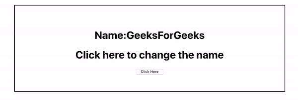

# ReactJS 绑定()方法

> 原文:[https://www.geeksforgeeks.org/reactjs-bind-method/](https://www.geeksforgeeks.org/reactjs-bind-method/)

bind()是 React 中的内置方法，用于将数据作为参数传递给基于类的组件的函数。

**语法:**

```
this.function.bind(this,[arg1...]);
```

**参数:**它接受两个参数，第一个参数是用于绑定的 ***这个*** 关键字，第二个参数是作为一个参数传递的序列参数，可选。

**创建反应应用程序:**

*   **步骤 1:** 使用以下命令创建一个反应应用程序:

    ```
    npx create-react-app foldername
    ```

*   **步骤 2:** 创建项目文件夹(即**文件夹名)后，使用以下命令将**移动到该文件夹:

    ```
    cd foldername
    ```

**例 1:**

*   **App.js:**

    ## java 描述语言

    ```
    import React from 'react';
    class App extends React.Component {
      // Initialising state
      state = {
        name: 'GFG',
      };

      handler = (name) => {
        // Changing the state
        this.setState({ name: name });
      };

      render() {
        return (
          <div>
            <h1>Name:{this.state.name}</h1>
            <h1>Click here to change the name</h1>

            {/* Passing the name as an argument 
             to the handler() function */}

            <button onClick={this.handler.bind(this, 'GeeksForGeeks')}>
              Click Here
            </button>
          </div>
        );
      }
    }

    export default App;
    ```

**运行应用程序的步骤:**从项目的根目录使用以下命令运行应用程序:

```
npm start
```

**输出:**


**例 2:** 我们也可以使用现代 ES6 提供的箭头功能。

1.  **App.js:**

    ## java 描述语言

    ```
    import React from 'react';
    class App extends React.Component {
      // Initialising state
      state = {
        name: 'GFG',
      };

      handler = (name) => {
        // Changing the state
        this.setState({ name: name });
      };

      render() {
        return (
          <div>
            <h1>Name:{this.state.name}</h1>
            <h1>Click here to change the name</h1>

            {/* Passing the name as an argument 
             to the handler() function 
             with modern ES6 feature*/}

            <button onClick={() => this.handler('GeeksForGeeks')}>
              Click Here
            </button>
          </div>
        );
      }
    }

    export default App;
    ```

**运行应用程序的步骤:**从项目的根目录使用以下命令运行应用程序:

```
npm start
```

**输出:**
