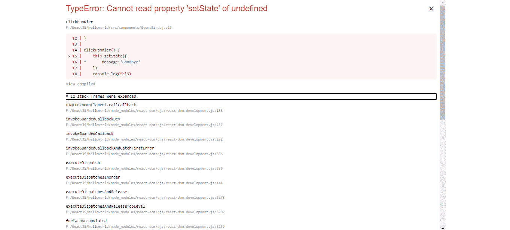
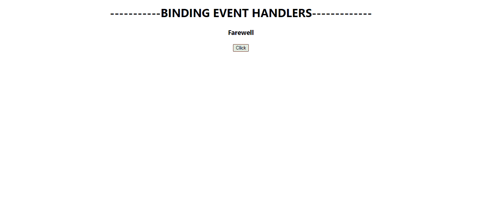

# 反应|绑定事件处理程序

> 原文:[https://www . geeksforgeeks . org/reactjs-binding-event-handlers/](https://www.geeksforgeeks.org/reactjs-binding-event-handlers/)

在 [**ReactJS**](https://www.geeksforgeeks.org/react-js-introduction-working/) 中，我们需要绑定事件，这样这个关键字就不会返回一个“**未定义的**”。在本文中，我们将看到在 **ReactJS** 中绑定事件处理程序的不同方式。

首先，让我们制作一个新的类组件，并将其命名为 **Binding.js.** 制作一个具有简单消息状态的简单类组件，并呈现一个简单的按钮，如下所示。不要忘记在 **App.js** 文件中导入该组件。

**Binding.js:**

## java 描述语言

```jsx
import React, { Component } from 'react';

class EventBind extends Component {
    constructor(props) {
        super(props)

        this.state = {
            message: 'Welcome'
        }
    }

    render() {
        return (
            <div>
                <h3>{this.state.message}</h3>
                <button>Click</button> 
            </div>
        )
    }
}

export default EventBind;
```

让我们写一个事件，每当点击按钮时，将消息的状态从 *'* 欢迎 *'* 更改为【告别 *'* 。因此，让我们为按钮定义一个 **onClick 方法**，并编写一个事件处理程序 **clickHandler()** 。

## java 描述语言

```jsx
import React, { Component } from 'react';

class EventBind extends Component {
    constructor(props) {
        super(props)

        this.state = {
            message: 'Welcome'
        }
    }

    clickHandler() {
        this.setState({
            message:'Farewell'
        })
    }

    render() {
        return (
            <div>
                <h3>{this.state.message}</h3>
                <button onClick={this.clickHandler}>Click</button> 
            </div>
        )
    }
}

export default EventBind;
```

**输出:**现在如果我们运行应用程序并点击按钮，我们会得到一个错误。这是因为*这个*返回一个*“未定义”*。这就是为什么我们需要绑定我们的事件。



错误

*   **在渲染方法中绑定事件处理程序:**我们可以使用 *bind()* 方法在渲染方法中调用处理程序时绑定它。

## java 描述语言

```jsx
import React, { Component } from 'react';

class EventBind extends Component {
    constructor(props) {
        super(props)

        this.state = {
            message: 'Welcome'
        }
    }

    clickHandler() {
        this.setState({
            message:'Farewell'
        })
    }

    render() {
        return (
            <div>
                <h3>{this.state.message}</h3>
                <button onClick={this.clickHandler.bind(this)}>
                         Click</button> 
            </div>
        )
    }
}

export default EventBind;
```

*   **使用箭头函数绑定事件处理程序:**这与上面的方法几乎相同，但是，在这种方法中，我们隐式绑定事件处理程序。如果您想将参数传递给事件，这种方法是最好的。

## java 描述语言

```jsx
import React, { Component } from 'react';

class EventBind extends Component {
    constructor(props) {
        super(props)

        this.state = {
            message: 'Welcome'
        }
    }

    clickHandler() {
        this.setState({
            message:'Farewell'
        })
    }

    render() {
        return (
            <div>
                <h3>{this.state.message}</h3>
                <button onClick={() => this.clickHandler()}>
                  Click
                </button> 
            </div>
        )
    }
}

export default EventBind;
```

*   **在构造函数中绑定事件处理程序:**在这种方法中，我们将在构造函数内部绑定事件处理程序。这也是 **ReactJS** [**文档**](https://reactjs.org/docs/handling-events.html) 中提到的方法。这具有性能优势，因为事件不是每次调用方法时都绑定的，这与前面两种方法相反。只需在该方法的构造函数中添加下面一行，

## java 描述语言

```jsx
this.clickHandler = this.clickHandler.bind(this)
```

*   **使用箭头函数作为类属性绑定事件处理程序:**这可能是绑定事件的最佳方式，并且仍然可以轻松地将参数传递给事件处理程序。

## java 描述语言

```jsx
import React, { Component } from 'react';

class EventBind extends Component {
    constructor(props) {
        super(props)

        this.state = {
            message: 'Welcome'
        }
    }

    clickHandler = () => {
        this.setState({
            message:'Farewell'
        })
    }

    render() {
        return (
            <div>
                <h3>{this.state.message}</h3>
                <button onClick={this.clickHandler}>
                  Click
                </button> 
            </div>
        )
    }
}

export default EventBind;
```

**输出:**所有这些方法都为问题提供了相同的解决方案，您可以根据自己的需求使用其中的任何一种。



单击按钮后的状态