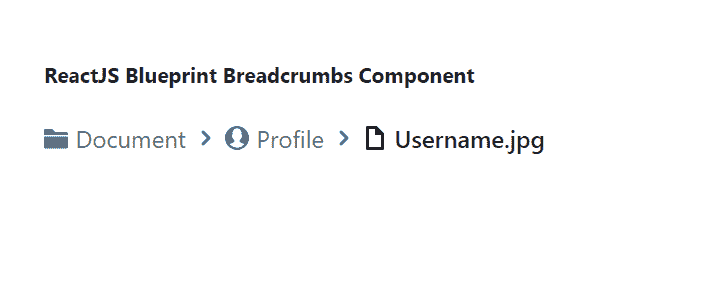

# 重新获取蓝图面包屑组件

> 原文:[https://www . geeksforgeeks . org/reactjs-蓝图-面包屑-组件/](https://www.geeksforgeeks.org/reactjs-blueprint-breadcrumbs-component/)

是一个基于反应的网络用户界面工具包。该库非常适合构建桌面应用程序的复杂数据密集型界面，并且非常受欢迎。

面包屑组件为用户提供了一种在应用程序中识别当前资源路径的方法。我们可以在 ReactJS 中使用以下方法来使用 ReactJS 蓝图面包屑组件。

**面包屑道具:**

*   **面包屑渲染器:**它是一个回调函数，被触发来渲染可见的面包屑。
*   **类名:**用于表示传递给子元素的以空格分隔的类名列表。
*   **折叠从:**用于指示面包屑应该从哪个方向折叠，即开始还是结束。
*   **currentBreadcrumbRenderer:**是一个回调函数，被触发来渲染当前的面包屑。
*   **项目:**用于表示所有要显示的面包屑。
*   **minVisibleItems:** 用于表示不应该折叠到溢出菜单中的可见面包屑的最小数量。
*   **overflowListProps:** 用来表示要扩散到 OverflowList 的道具。
*   **popoverProps:** 用于表示扩散到 Popover 显示溢出菜单的道具。

**面包屑道具:**

*   **类名:**用于表示传递给子元素的以空格分隔的类名列表。
*   **当前:**用于表示该面包屑是否为当前面包屑。
*   **禁用:**用于表示该动作是否非交互。
*   **href:** 用于表示链接网址。
*   **图标:**用于表示要在文本前渲染的图标或图标元素的名称。
*   **意图:**用于表示应用于元素的视觉意图颜色。
*   **onClick:** 用于表示点击事件处理程序。
*   **目标:**用于表示链接目标属性。
*   **文本:**用于表示动作文本。

**创建反应应用程序并安装模块:**

*   **步骤 1:** 使用以下命令创建一个反应应用程序:

    ```jsx
    npx create-react-app foldername
    ```

*   **步骤 2:** 创建项目文件夹后，即文件夹名称**，**使用以下命令移动到项目文件夹:

    ```jsx
    cd foldername
    ```

*   **步骤 3:** 创建 ReactJS 应用程序后，使用以下命令安装所需的****模块:****

    ```jsx
    **npm install @blueprintjs/core**
    ```

******项目结构:**如下图。****

****

项目结构**** 

******示例:**现在在 **App.js** 文件中写下以下代码。在这里，App 是我们编写代码的默认组件。****

## ****App.js****

```jsx
**import React from 'react'
import '@blueprintjs/core/lib/css/blueprint.css';
import { Breadcrumbs } from "@blueprintjs/core";

function App() {

    // Sample Breadscrum items
    const sampleItems = [
        { href: "/document", icon: "folder-close", text: "Document" },
        { href: "/document/profile", icon: "user", text: "Profile" },
        { icon: "document", text: "Username.jpg" },
    ];

    return (
        <div style={{
            display: 'block', width: 400, padding: 30
        }}>
            <h4>ReactJS Blueprint Breadcrumbs Component</h4>
            <Breadcrumbs
                items={sampleItems}
            />
        </div >
    );
}

export default App;**
```

******运行应用程序的步骤:**从项目的根目录使用以下命令运行应用程序:****

```jsx
**npm start**
```

******输出:**现在打开浏览器，转到***http://localhost:3000/***，会看到如下输出:****

********

******参考:**T2】https://blueprintjs.com/docs/#core/components/breadcrumbs****