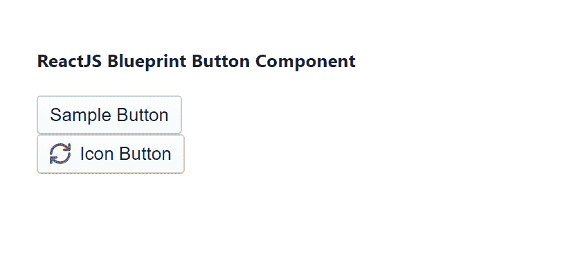

# 反应堆蓝图按钮组件

> 原文:[https://www . geesforgeks . org/reactjs-蓝图-按钮-组件/](https://www.geeksforgeeks.org/reactjs-blueprint-button-component/)

是一个基于反应的网络用户界面工具包。该库非常适合构建桌面应用程序的复杂数据密集型界面，并且非常受欢迎。按钮组件为用户提供了一种只需轻点一下就能采取行动和做出选择的方式。我们可以在 reatjs 中使用以下方法来使用 reatjs 蓝图按钮组件。

**按钮道具:**

*   **激活:**如果设置为真，按钮将显示激活状态。
*   **对齐文本:**用于按钮内的文本对齐。
*   **类名:**用于表示传递给子元素的以空格分隔的类名列表。
*   **禁用:**用于表示该动作是否非交互。
*   **elementRef:** 用于表示接收该组件呈现的原生 HTML 元素的引用处理程序或引用对象。
*   **填充:**用于指示该按钮是否应该展开以填充其容器。
*   **图标:**用于表示要在文本前渲染的蓝图 UI 图标(或图标元素)的名称。
*   **意图:**用于表示应用于元素的视觉意图颜色。
*   **大:**用于表示该按钮是否应该使用大样式。
*   **加载:**当设置为真时，按钮将显示居中的加载微调器，而不是其内容。
*   **最小:**用于表示该按钮是否应该使用最小样式。
*   **onClick:** 用于表示点击事件处理程序。
*   **轮廓:**用于表示该按钮是否应该使用轮廓样式。
*   **rightIcon:** 用于表示文本后要渲染的蓝图 UI 图标(或图标元素)的名称。
*   **小:**用于表示该按钮是否应该使用小样式。
*   **文本:**用于表示动作文本。
*   **类型:**用于表示按钮的 HTML 类型属性。

**创建反应应用程序并安装模块:**

*   **步骤 1:** 使用以下命令创建一个反应应用程序:

    ```
    npx create-react-app foldername
    ```

*   **步骤 2:** 在创建项目文件夹(即文件夹名**)后，使用以下命令将**移动到该文件夹:

    ```
    cd foldername
    ```

*   **步骤 3:** 创建 ReactJS 应用程序后，使用以下命令安装所需的****模块:****

    ```
    **npm install @blueprintjs/core**
    ```

******项目结构:**如下图。****

****

项目结构**** 

******示例:**现在在 **App.js** 文件中写下以下代码。在这里，App 是我们编写代码的默认组件。****

## ****App.js****

```
**import React from 'react'
import '@blueprintjs/core/lib/css/blueprint.css';
import { Button } from "@blueprintjs/core";

function App() {
    return (
        <div style={{
            display: 'block', width: 700, padding: 30
        }}>
            <h4>ReactJS Blueprint Button Component</h4>
            <Button>Sample Button</Button> <br></br>
            <Button icon="refresh">Icon Button</Button>
        </div>
    );
}

export default App;**
```

******运行应用程序的步骤:**从项目的根目录使用以下命令运行应用程序:****

```
**npm start**
```

******输出:**现在打开浏览器，转到***http://localhost:3000/***，会看到如下输出:****

********

******参考:**T2】https://blueprintjs.com/docs/#core/components/button****