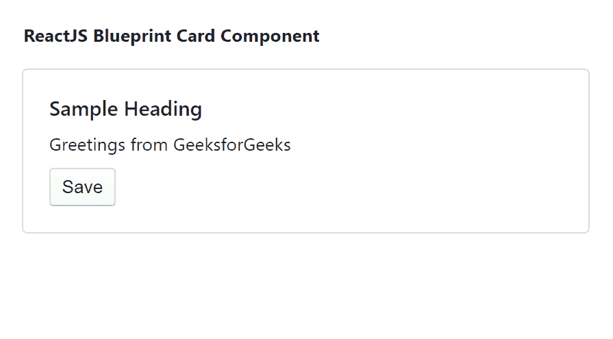

# 反应堆蓝图卡组件

> 原文:[https://www . geesforgeks . org/reactjs-蓝图-卡片-组件/](https://www.geeksforgeeks.org/reactjs-blueprint-card-component/)

是一个基于反应的网络用户界面工具包。该库非常适合构建桌面应用程序的复杂数据密集型界面，并且非常受欢迎。 Card Component 作为一个简单的矩形容器，当用户想要显示与单个主题相关的内容时使用。我们可以在 ReactJS 中使用以下方法来使用 ReactJS 蓝图卡组件。

**卡牌道具:**

*   **类名:**用于表示传递给子元素的以空格分隔的类名列表。
*   **仰角:**用于控制卡片下方的投影强度。
*   **交互:**用于表示卡片是否要响应用户交互。
*   **onClick:** 用于表示点击事件处理程序。

**创建反应应用程序并安装模块:**

*   **步骤 1:** 使用以下命令创建一个反应应用程序:

    ```jsx
    npx create-react-app foldername
    ```

*   **步骤 2:** 创建项目文件夹(即文件夹名**)后，使用以下命令移动到该文件夹中:**

    ```jsx
    cd foldername
    ```

*   **步骤 3:** 创建 ReactJS 应用程序后，使用以下命令安装所需的****模块:****

    ```jsx
    **npm install @blueprintjs/core**
    ```

******项目结构:**如下图。****

****

项目结构**** 

******示例:**现在在 **App.js** 文件中写下以下代码。在这里，App 是我们编写代码的默认组件。****

## ****App.js****

```jsx
**import React from 'react'
import '@blueprintjs/core/lib/css/blueprint.css';
import { Card, Button, H5 } from "@blueprintjs/core";

function App() {
    return (
        <div style={{
            display: 'block', width: 500, padding: 30
        }}>
            <h4>ReactJS Blueprint Card Component</h4>
            <Card>
                <H5>Sample Heading</H5>
                <p>Greetings from GeeksforGeeks</p>

                <Button text="Save" />
            </Card>
        </div>
    );
}

export default App;**
```

******运行应用程序的步骤:**从项目的根目录使用以下命令运行应用程序:****

```jsx
**npm start**
```

******输出:**现在打开浏览器，转到***http://localhost:3000/***，会看到如下输出:****

********

******参考:**T2】https://blueprintjs.com/docs/#core/components/card****