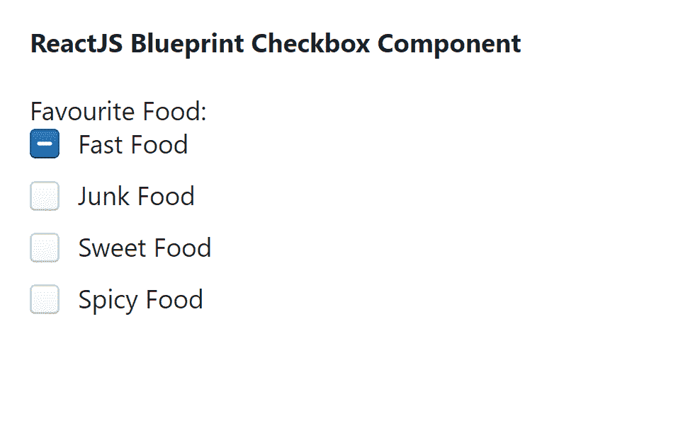

# 重新获取蓝图复选框组件

> 原文:[https://www . geesforgeks . org/reactjs-蓝图-复选框-组件/](https://www.geeksforgeeks.org/reactjs-blueprint-checkbox-component/)

是一个基于反应的网络用户界面工具包。该库非常适合构建桌面应用程序的复杂数据密集型界面，并且非常受欢迎。复选框组件为用户提供了一种在选中、未选中和不确定状态之间切换的方式。我们可以在 reatjs 中使用以下方法来使用 reatjs 蓝图复选框组件。

**复选框道具:**

*   **对齐指示器:**用于容器内指示器的对齐。
*   **已检查:**用于指示控件是否已检查。
*   **儿童:**用于表示对照的 JSX 标签。
*   **类名:**用于表示传递给子元素的以空格分隔的类名列表。
*   **缺省检查:**用于指示控制是否初始检查(非受控模式)。
*   **缺省终止:**用于指示该复选框最初是否不确定(不受控制的模式)。
*   **禁用:**用于指示控件是否非交互。
*   **不确定:**用于指示该复选框是不确定的，还是部分选中的。
*   **内联:**用于指示控件是否应该作为内联元素出现。
*   **inputRef:** 用于表示接收支持该组件的 HTML <输入>元素的引用处理程序。
*   **标签:**用于表示控件的文本标签。
*   **标签元素:**用于表示控件的 JSX 元素标签。
*   **大:**用于表示该控件是否应该使用大样式。
*   **onChange:** 用于表示输入值改变时调用的事件处理程序。
*   **标记名:**用于表示包装复选框的 HTML 标记的名称。

**创建反应应用程序并安装模块:**

**步骤 1:** 使用以下命令创建一个反应应用程序:

```
npx create-react-app foldername
```

**步骤 2:** 在创建项目文件夹(即文件夹名**)后，使用以下命令将**移动到该文件夹:

```
cd foldername
```

**步骤 3:** 创建 ReactJS 应用程序后，使用以下命令安装所需的****模块:****

```
**npm install @blueprintjs/core**
```

******项目结构:**如下图。****

****

项目结构**** 

******示例:**现在在 **App.js** 文件中写下以下代码。在这里，App 是我们编写代码的默认组件。****

## ****java 描述语言****

```
**import React from 'react'
import '@blueprintjs/core/lib/css/blueprint.css';
import { Checkbox } from "@blueprintjs/core";

function App() {

    return (
        <div style={{
            display: 'block', width: 500, padding: 30
        }}>
            <h4>ReactJS Blueprint Checkbox Component</h4>
            Favourite Food:
            <Checkbox label="Fast Food" defaultIndeterminate={true} />
            <Checkbox label="Junk Food" />
            <Checkbox label="Sweet Food" />
            <Checkbox label="Spicy Food" />
        </div>
    );
}

export default App;**
```

******运行应用程序的步骤:**从项目的根目录使用以下命令运行应用程序:****

```
**npm start**
```

******输出:**现在打开浏览器，转到***http://localhost:3000/***，会看到如下输出:****

********

******参考:**T2】https://blueprintjs.com/docs/#core/components/checkbox****