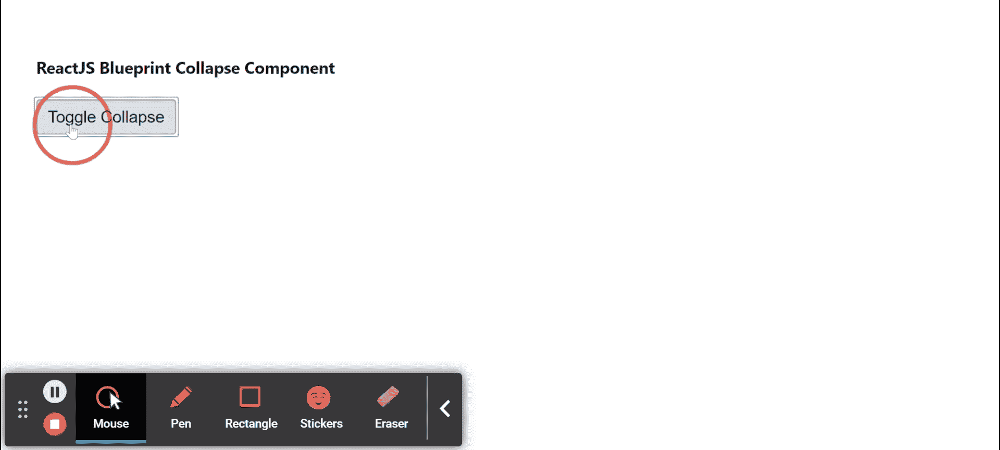

# 反应堆蓝图折叠组件

> 原文:[https://www . geeksforgeeks . org/reactjs-蓝图-折叠-组件/](https://www.geeksforgeeks.org/reactjs-blueprint-collapse-component/)

是一个基于反应的网络用户界面工具包。该库非常适合构建桌面应用程序的复杂数据密集型界面，并且非常受欢迎。折叠组件为用户提供了一种通过内置的滑入/滑出动画来显示和隐藏内容的方式。  我们可以在 ReactJS 中使用以下方法来使用 ReactJS 蓝图折叠组件。

**塌陷道具:**

*   **类名:**用于表示传递给子元素的以空格分隔的类名列表。
*   **组件:**用于表示作为根元素渲染的组件。
*   **isOpen:** 用于指示部件是打开还是关闭。
*   **保持子组件安装:**用于指示折叠关闭时子组件是否保持安装状态。
*   **过渡持续时间:**用于表示过渡所用的时间长度，单位为毫秒。

**创建反应应用程序并安装模块:**

*   **步骤 1:** 使用以下命令创建一个反应应用程序:

    ```jsx
    npx create-react-app foldername
    ```

*   **步骤 2:** 在创建项目文件夹(即文件夹名**)后，使用以下命令将**移动到该文件夹:

    ```jsx
    cd foldername
    ```

*   **步骤 3:** 创建 ReactJS 应用程序后，使用以下命令安装所需的****模块:****

    ```jsx
    **npm install @blueprintjs/core**
    ```

******项目结构:**如下图。****

****

项目结构**** 

******示例:**现在在 **App.js** 文件中写下以下代码。在这里，App 是我们编写代码的默认组件。****

## ****App.js****

```jsx
**import React from 'react'
import '@blueprintjs/core/lib/css/blueprint.css';
import { Collapse, Button } from "@blueprintjs/core";

function App() {

    // State to maintain Collapse isOpen value
    const [isOpen, setIsOpen] = React.useState(false)

    return (
        <div style={{
            display: 'block', width: 500, padding: 30
        }}>
            <h4>ReactJS Blueprint Collapse Component</h4>
            <Button onClick={() => setIsOpen(!isOpen)}>Toggle Collapse
            </Button>
            <Collapse isOpen={isOpen}>
                Sample Text to display!
            </Collapse>
        </div>
    );
}

export default App;**
```

******运行应用程序的步骤:**从项目的根目录使用以下命令运行应用程序:****

```jsx
**npm start**
```

******输出:**现在打开浏览器，转到***http://localhost:3000/***，会看到如下输出:****

********

******参考:**T2】https://blueprintjs.com/docs/#core/components/collapse****