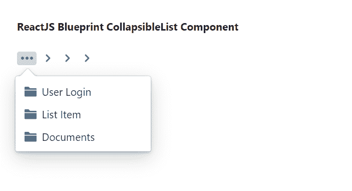

# 重新获取蓝图可折叠列表组件

> 原文:[https://www . geeksforgeeks . org/reactjs-蓝图-collapsablelist-component/](https://www.geeksforgeeks.org/reactjs-blueprint-collapsiblelist-component/)

是一个基于反应的网络用户界面工具包。该库非常适合构建桌面应用程序的复杂数据密集型界面，并且非常受欢迎。

折叠列表组件为用户提供了一种方法来精确显示传递的许多项目，并将其余项目折叠成下拉菜单。我们可以在 reatjs 中使用以下方法来使用 reatjs 蓝图折叠列表组件。

**收集列表道具:**

*   **类名:**用于表示传递给子元素的以空格分隔的类名列表。
*   **collapseFrom:** 用于表示项目应该从哪个方向折叠，即从子项目的开始或结束。
*   **dropdowrops:**用来表示传递给下拉的道具。
*   **dropdownTarget:** 用于表示通过点击交互呈现为下拉目标的元素，以显示折叠的菜单。
*   **visibleItemClassName:** 用于表示要添加到包含每个可见项目和下拉列表的< li >标签中的 CSS 类名。
*   **visibleItemCount:** 用于表示可见项目的准确数量。
*   **visibleItemRenderer:** 用于表示调用回调来渲染每个可见项目。

**创建反应应用程序并安装模块:**

*   **步骤 1:** 使用以下命令创建一个反应应用程序:

    ```jsx
    npx create-react-app foldername
    ```

*   **步骤 2:** 创建项目文件夹(即文件夹名**)后，使用以下命令移动到该文件夹中:**

    ```jsx
    cd foldername
    ```

*   **步骤 3:** 创建 ReactJS 应用程序后，使用以下命令安装所需的****模块:****

    ```jsx
    **npm install @blueprintjs/core**
    ```

******项目结构:**如下图。****

****

项目结构**** 

******示例:**现在在 **App.js** 文件中写下以下代码。在这里，App 是我们编写代码的默认组件。****

## ****App.js****

```jsx
**import React from 'react'
import '@blueprintjs/core/lib/css/blueprint.css';
import { CollapsibleList, MenuItem, Classes } from "@blueprintjs/core";

function App() {

    return (
        <div style={{
            display: 'block', width: 400, padding: 30
        }}>
            <h4>ReactJS Blueprint CollapsibleList Component</h4>
            <CollapsibleList
                className={Classes.BREADCRUMBS}
                dropdownTarget={<span className={Classes.BREADCRUMBS_COLLAPSED} />}
                visibleItemRenderer={() => {}}
            >
                <MenuItem icon="folder-close" text="Documents" href="#" />
                <MenuItem icon="folder-close" text="List Item" href="#" />
                <MenuItem icon="folder-close" text="User Login" href="#" />
                <MenuItem icon="folder-close" text="Jobs" href="#" />
                <MenuItem icon="folder-close" text="Daylight" href="#" />
                <MenuItem icon="document" text="How to crush it" />
            </CollapsibleList>
        </div >
    );
}

export default App;**
```

******运行应用程序的步骤:**从项目的根目录使用以下命令运行应用程序:****

```jsx
**npm start**
```

******输出:**现在打开浏览器，转到***http://localhost:3000/***，会看到如下输出:****

********

******参考:**[https://bluepointjs . com/docs/# core/components/可折叠列表](https://blueprintjs.com/docs/#core/components/collapsible-list)****