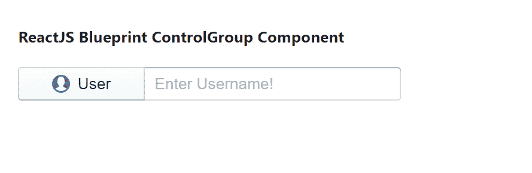

# 反应堆蓝图控制组组件

> 原文:[https://www . geesforgeks . org/reactjs-蓝图-控制组-组件/](https://www.geeksforgeeks.org/reactjs-blueprint-controlgroup-component/)

是一个基于反应的网络用户界面工具包。该库非常适合构建桌面应用程序的复杂数据密集型界面，并且非常受欢迎。控件组组件为用户提供了一种将几个不同的表单控件呈现为一个单元的方式，并且它还提供了使它们之间的边界成方形的功能。我们可以在 reatjs 中使用以下方法来使用 reatjs 蓝图控制组组件。

**控制组道具:**

*   **类名:**用于表示传递给子元素的以空格分隔的类名列表。
*   **填充:**用于表示对照组是否应占据其容器的全部宽度。
*   **垂直**:用于表示对照组是否应该以垂直造型出现。

**创建反应应用程序并安装模块:**

**步骤 1:** 使用以下命令创建一个反应应用程序:

```jsx
npx create-react-app foldername
```

**步骤 2:** 在创建项目文件夹(即文件夹名**)后，使用以下命令将**移动到该文件夹:

```jsx
cd foldername
```

**步骤 3:** 创建 ReactJS 应用程序后，使用以下命令安装所需的****模块:****

```jsx
**npm install @blueprintjs/core**
```

******项目结构:**如下图。****

****

项目结构**** 

******示例 1:** 现在在 **App.js** 文件中写下以下代码。这里，我们演示了水平控制组组件。****

## ****java 描述语言****

```jsx
**import React from 'react'
import '@blueprintjs/core/lib/css/blueprint.css';
import { ControlGroup, InputGroup, Button } from "@blueprintjs/core";

function App() {
    return (
        <div style={{
            display: 'block', width: 400, padding: 30
        }}>
            <h4>ReactJS Blueprint ControlGroup Component</h4>
            <div >
                <ControlGroup fill={true}>
                    <Button icon="user">User</Button>
                    <InputGroup placeholder="Enter Username!" />
                </ControlGroup>
            </div>
        </div >
    );
}

export default App;**
```

******运行应用程序的步骤:**从项目的根目录使用以下命令运行应用程序:****

```jsx
**npm start**
```

******输出:**现在打开浏览器，转到***http://localhost:3000/***，会看到如下输出:****

********

******示例 2:** 现在在 **App.js** 文件中写下以下代码。这里，我们演示了垂直控制组组件。****

## ****java 描述语言****

```jsx
**import React from 'react'
import '@blueprintjs/core/lib/css/blueprint.css';
import { ControlGroup, InputGroup, Button } from "@blueprintjs/core";

function App() {
    return (
        <div style={{
            display: 'block', width: 400, padding: 30
        }}>
            <h4>ReactJS Blueprint ControlGroup Component</h4>
            <div >
                <ControlGroup fill={true} vertical={true}>
                    <Button icon="user">User</Button>
                    <InputGroup placeholder="Enter Username!" />
                </ControlGroup>
            </div>
        </div >
    );
}

export default App;**
```

******运行应用程序的步骤:**从项目的根目录使用以下命令运行应用程序:****

```jsx
**npm start**
```

******输出:**现在打开浏览器，转到***http://localhost:3000/***，会看到如下输出:****

********

******参考:**T2】https://blueprintjs.com/docs/#core/components/control-group****